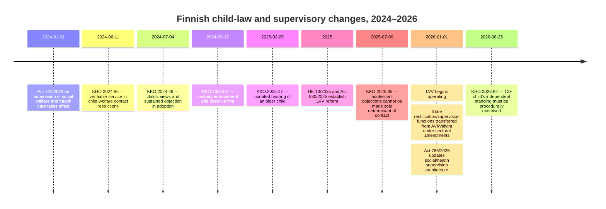
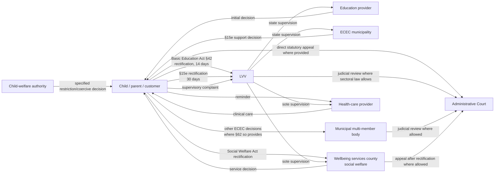

# Targeted Finnish Legal Update: Child Participation, Contact Restrictions and the Lupa- ja valvontavirasto Reform

**Jurisdiction:** Finland  
**Research cut-off:** 7 September 2026  
**Period examined:** 2024–2026  
**Language:** English (UK)

## Executive summary

Two developments materially change how Finnish child-related cases and administrative remedies should be approached in 2026.

First, the Supreme Court (*Korkein oikeus*, KKO) has significantly refined the law on children's participation and objections to contact. **KKO:2025:17** holds, by a 3–2 majority, that an older child's views cannot simply be treated as frozen by an earlier hearing: a child who was 10–11 at an earlier assessment and 14 at the new proceedings may have developed a materially more independent capacity to form and express a view. In that case, reliance on information about the child's views gathered more than three years earlier was insufficient to summarily reject the father's renewed custody/contact application without considering an updated hearing.

**KKO:2025:65** then draws an exceptionally important distinction between **hearing a child and making the child decide**. Two children, then aged 14 and 15, had consistently and independently opposed contact with their mother for years. KKO accepted that their views were genuine and deserved considerable weight, but held that the substantive contact decision could not simply be left entirely to the children: doing so made the contact right nominal and ineffective and transferred adult decision-making responsibility to them. The Court instead ordered a phased route from letters to telephone contact, then supported meetings, then ordinary contact.

The same decision expressly confirms that the familiar Finnish **“12-year rule” is process-specific**. In a substantive custody/contact case, a 12-year-old does not acquire an absolute veto merely by reaching 12. By contrast, the Act on Enforcement of Decisions concerning Child Custody and Right of Access contains a distinct rule preventing enforcement against the will of a child aged 12 or more. KKO expressly warned against conflating the two contexts.

KKO:2025:65 is equally important for what it **does not** establish. Although the children had been completely estranged from their mother, KKO found no basis for concluding that the father had caused that estrangement. Nor did it treat genuine opposition as irrelevant. Rather, it asked whether actual danger or harm justified removing contact, and, finding that the evidence did not demonstrate such danger or harm in the current circumstances, devised a less intrusive, gradual form of contact.

On the administrative-law side, **KHO:2024:86** strengthens procedural protection in child-welfare contact restrictions. A restriction on a child's contact with a parent is not merely an internal child-welfare measure; because it directly restricts parent–child family life, the administrative court's decision had to be served in a manner adequate for a binding decision affecting the parent. Ordinary service was insufficient in the circumstances. The case has practical importance for the calculation of appeal periods.

**KHO:2026:62**, although not itself a merits decision on contact, adds an important participation rule: a child aged 12 or over has independent standing alongside the guardian or other legal representative in child-welfare proceedings, but that independent standing must be procedurally exercised. A child could not enter the case for the first time at KHO merely because a foster carer — who was not the child's legal representative — had appealed to the administrative court.

Second, Finland's state supervisory architecture changed fundamentally on **1 January 2026**. The **Lupa- ja valvontavirasto (LVV)** was established by Act 530/2025 as a new nationwide authority. The reform consolidated functions formerly exercised by Valvira, the six Regional State Administrative Agencies (*aluehallintovirastot*, AVI) and functions transferred from ELY Centres. The old authorities ceased operating at the end of 2025 and LVV began on 1 January 2026.

That organisational consolidation must **not** be misunderstood as creating one universal appellate authority. LVV now receives specified *oikaisuvaatimukset* in education and early-childhood education and exercises substantial supervisory functions, especially in social and health care. But an ordinary social-welfare service decision is generally rectified first by the **wellbeing services county**, not LVV; ordinary clinical treatment decisions do not acquire a general appeal to LVV; and special statutory decisions may go directly to an administrative court. LVV itself states that a social/health complaint cannot be used to make it overturn a diagnosis or treatment decision or order a particular treatment or service.

There is also a concrete **guidance-versus-statute transition problem**. As checked on 7 September 2026, an OPH page on early-childhood support still states that rectification of a decision on intensified/special support or support services is sought from the **Regional State Administrative Agency (AVI)** within 30 days and even links to AVI. That institutional reference is obsolete: LVV has replaced AVI for this remedy. LVV's own current page correctly states that early-childhood-education rectification matters have a 30-day period.

The harmonised 2026 wording should therefore be:

> **“A request for rectification of a decision under section 15e of the Early Childhood Education and Care Act concerning intensified or special support or support services is made to the Lupa- ja valvontavirasto (LVV) within 30 days of service. For other early-childhood-education decisions, the competent rectification authority depends on the type of decision and section 62 of the Act; the decision-specific rectification instructions must be checked.”**

For basic education, the corresponding safe formulation is:

> **“For decisions listed in section 42 of the Basic Education Act, a request for rectification is made to LVV within 14 days of receipt of the decision. Not every disagreement concerning a school constitutes a section 42 rectification matter.”**

LVV's current instructions confirm the practical distinction: **14 days for pupil/student matters and 30 days for early-childhood-education matters**.

## Case-law update (2024–2026)

| Decision | Date and relevance | Material facts | Legal issue | Holding | Practical implications | Official source |
|---|---|---|---|---|---|---|
| **KHO:2024:86** | 11 Jun 2024 — **direct: child-welfare contact restriction** | A parent appealed three decisions restricting a child born in 2006 from keeping contact with her. The administrative court rejected the appeals and sent its decision by ordinary service. | Whether ordinary service was sufficient and therefore started the period for seeking leave to appeal to KHO. | Because a contact-restriction decision directly interferes with the parent's family life as well as the child's position, the judicial decision required the legally appropriate verifiable form of service; ordinary service was inadequate. | Authorities and courts must treat contact restrictions as genuine coercive interferences with parent–child family life. Appeal deadlines should not be assumed to have started on the basis of defective service. | [KHO:2024:86](https://www.kho.fi/paatokset/kho202486/) |
| **KKO:2024:46** | 4 Jul 2024 — **adjacent: child's sustained objection to contact in adoption proceedings** | An 11-year-old had legal/social family ties with D and a biological/social father A. Regular contact with D ceased after the child began clearly opposing meetings. | Weight to be given to the child's wishes when determining whether an adoption opposed by the legal father could exceptionally be confirmed. | KKO held that a child's views must be weighed by age and development and are not themselves decision-making authority. The child's sustained opposition was relevant and appeared independently formed, but formed part of a wider best-interests assessment. | Useful evidence of the increasingly strong weight given to an older child's independently formed view. **Do not transpose the Adoption Act's specific consent rules into ordinary custody/contact law.** | [KKO:2024:46](https://www.korkeinoikeus.fi/ennakkopaatokset/ennakkopaatokset-vuosittain/kko202446/) |
| **KKO:2024:52** | 17 Sep 2024 — **adjacent: enforcement of custody decision** | A mother removed a very young child from Finland while custody proceedings were pending, subsequently kept the child and her location unknown, and did not comply with obligations backed by a coercive fine to disclose the child's location and assist return. | International jurisdiction and whether later stabilisation of the child's circumstances prevented enforcement of the coercive fine. | Finnish courts had jurisdiction. Because the mother's own conduct had left the other parent and authorities without reliable information about whether the child's circumstances safeguarded the child's development and welfare, the purported stabilisation could not be given decisive weight; the fine was imposed. | A parent cannot normally create a favourable enforcement position through concealment and then rely on the resulting passage of time where the child's welfare cannot be independently assessed. The case **does not establish a rule about an older child's objection to contact**. | [KKO:2024:52](https://www.korkeinoikeus.fi/ennakkopaatokset/ennakkopaatokset-vuosittain/kko202452/) |
| **KKO:2025:17** | 5 Feb 2025 — **direct: updating a child's views/hearing** | A child had been heard at age 10 in earlier proceedings. At 14, the father sought expanded contact/alternating residence and said the child wanted to be heard. The district court summarily dismissed the application under section 14a, relying partly on the earlier assessment that the child's views had then been affected by the father's dominant manner. | Could the renewed application be summarily dismissed without obtaining an updated view from the now substantially older child? | **No, by 3–2 majority.** As children mature, their opinion formation can become more independent; an older and more mature child's independently reasoned view deserves greater weight. Information more than three years old could not alone make it obvious that there were no grounds to reconsider the earlier order. Asking the child whether they wished to be heard was not contrary to the child's interests. | Courts should not treat a previous child interview as indefinitely current. Ageing from late childhood into adolescence can itself make an updated assessment material. But the dissent highlights the countervailing duty to protect children from repetitive litigation and repeated evidential use. | [KKO:2025:17](https://www.korkeinoikeus.fi/ennakkopaatokset/ennakkopaatokset-vuosittain/kko202517/) |
| **KKO:2025:65** | 9 Jul 2025 — **direct and leading: adolescents' objections to contact** | Children born in 2010 and 2011 had not seen their mother since March 2020. By KKO they were 14 and 15 and had consistently opposed all contact. Their views were considered genuine and independently formed; no current objective danger from contact with the mother was established, and KKO could not conclude that the father had caused the estrangement. | Could contact simply be ordered to occur whenever the children themselves wanted it, effectively leaving the substantive decision entirely to them? | **No.** Their views had substantial weight but were not an absolute veto. Leaving contact entirely to them made the legal right nominal and ineffective and improperly shifted decision responsibility onto the children. KKO ordered a staged sequence: letters, telephone contact, supported meetings, then ordinary weekend/holiday contact, with later arrangements retaining sensitivity to the children's wishes. | This is the principal 2024–2026 authority for the proposition that **participation is not delegation of decision-making**. It also requires consideration of less restrictive and graduated alternatives before abandoning contact where actual danger/harm has not been established. | [KKO:2025:65](https://www.korkeinoikeus.fi/ennakkopaatokset/ennakkopaatokset-vuosittain/kko202565/) |
| **KHO:2026:62** | 25 Aug 2026 — **directly relevant to child participation/standing in child welfare** | A 12+ child was moved from a foster placement with grandparents to a child-welfare unit. The foster carer appealed to the administrative court, but the child did not independently appeal and the foster carer was not the child's legal representative. | Could the child independently seek further review at KHO when the child's own appellate standing had not been exercised before the administrative court? | **No in those procedural circumstances.** Child Welfare Act section 21 gives a child aged 12+ independent standing alongside the guardian/legal representative, but the foster carer's appeal did not exercise that standing for the child. | A child's independent procedural rights must be made effective at the correct stage. Authorities, representatives and lawyers should not assume that another interested adult's appeal preserves the child's separate appellate position. | [KHO:2026:62](https://www.kho.fi/paatokset/kho202662/) |

### The doctrinal line emerging from the cases

The strongest synthesis is **not** “older children decide for themselves”. Rather, Finnish law now points towards a four-stage analysis:

1. **Obtain a sufficiently current and child-sensitive account of the child's wishes:** KKO:2025:17 makes clear that a materially older child's views cannot necessarily be inferred from an old assessment.
2. **Determine the independence, consistency, maturity and reasons underlying the child's view:** KKO:2025:65 accepted that the 14- and 15-year-olds' objections were genuine and independent; KKO nevertheless did not treat that finding as ending the legal inquiry.
3. **Assess the child-protection side separately:** Is there actual evidence that contact creates danger or harm to health or development? KKO:2025:65 explicitly contrasted its facts with KKO:2023:5, where violence, fear and psychological fragility had justified removing even supervised contact.
4. **Determine the least harmful legally effective arrangement:** Complete cessation is exceptional; letters, remote communication, supported or supervised meetings and staged restoration may be relevant alternatives.

> **Child's voice ≠ child's burden to decide**  
> **Right to contact ≠ contact at any cost**

---

## LVV reform and statutory timeline

The LVV reform is part of the broader 2025 state regional-administration restructuring reflected in Government Proposal **HE 13/2025**. Act **530/2025 on the Lupa- ja valvontavirasto** created the new nationwide agency, which began operating on 1 January 2026. The reform brought together functions formerly exercised by Valvira and the Regional State Administrative Agencies and transferred specified ELY functions into the new structure.

For social and health care, this transition sits on top of another recent reform: the **Act on the Supervision of Social Welfare and Health Care 741/2023** took effect from 1 January 2024, creating the modern unified framework for service-provider registration, self-monitoring and state supervision. Act **766/2025** amended that framework for the new LVV structure from 2026.

---

## Appeal, rectification and supervision map (2026)

| Sector / decision type | First decision-maker | Current first review route in 2026 | Time limit / next judicial step | LVV's role | Statutory basis and effective position |
|---|---|---|---|---|---|
| **Basic education: decisions specifically listed in Basic Education Act §42**, including pupil admission, individual pupil support and specified support/services | Municipality / education provider / competent official | **Rectification request to LVV** | LVV states **14 days from receipt** for pupil/student matters. | **Administrative rectification authority** for listed decisions; also receives complaints | Basic Education Act 628/1998, §§42 ff.; state authority changed to LVV from **1 Jan 2026**. |
| **Basic education: operational/pedagogical disagreement that is not a §42 decision** | School / education provider | No automatic LVV rectification merely because dispute concerns school | Depends on legal character; complaint possible, but no substitute for appealable decision | Possible **legality-supervision/complaint** role, not universal appellate role | Decision-specific analysis required. |
| **ECEC: intensified/special support or support services under Early Childhood Education and Care Act §15e** | Municipality responsible for ECEC | **Rectification request to LVV** | **30 days** according to LVV's current instruction | Administrative rectification authority | ECEC Act 540/2018 §§15e, 62. |
| **Other ECEC decisions for which §62 assigns rectification to municipal body** | Municipality / competent official | **Municipal multi-member body**, not LVV | General administrative rectification rules apply | LVV is **not** the first rectification authority | ECEC Act §62. |
| **Ordinary individual social-welfare service decision under the Social Welfare Act** | Wellbeing services county / competent official | **Rectification to wellbeing services county**, not LVV | Normally **30 days** (APA 49c §); further appeal to Administrative Court | LVV supervises legality/quality, but is **not ordinary rectification authority for service decision** | Social Welfare Act 1301/2014 §50 and APA 434/2003 §49c. |
| **Child-welfare decisions with statutory direct court appeal**, including restriction/coercive decisions | Child-welfare authority / official | **Administrative court** where Child Welfare Act provides direct appeal | Governed by Child Welfare Act | LVV complaint cannot substitute for judicial appeal | Child Welfare Act 417/2007, §§21 and 89–92. KHO:2024:86 and KHO:2026:62. |
| **Ordinary health-care treatment, diagnosis or clinical decision** | Treating unit / health professional | **No general LVV oikaisuvaatimus** against clinical care | Reminder to unit, supervisory complaint | LVV cannot overturn a diagnosis or order a particular treatment/service | Patient-rights legislation; LVV guidance. |
| **Social/health complaint about legality, quality or professional conduct** | — | **Complaint to LVV**; normally reminder to unit first | Supervisory, not ordinary merits appeal | Core post-2026 state supervisory authority | Act 741/2023 as amended by Act 766/2025. |

---

## Key Supplementary Decisions

* **EOAK/6970/2024:** School information rights / Wilma access arrangements. Technical information-system arrangements cannot restrict or determine the content of a guardian's statutory information right.
* **EOAK/967/2024:** Minor patient's decision-making capacity and documentation in health care. Capacity is assessed individually rather than by a fixed age, and both the assessment and disclosure positions require proper documentation.
