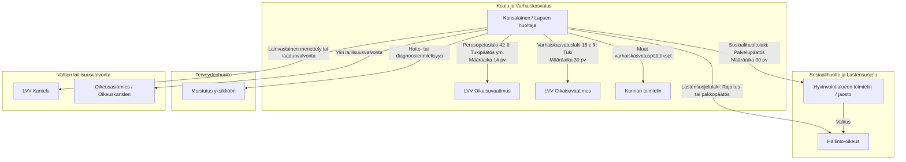

# 10. Oikeussuojakeinot

**Tutkimuspäivä: 4.9.2026**

Tässä luvussa esitetään oikeussuojakeinojen käytännöllinen etenemisjärjestys, keskeiset määräajat sekä se, milloin tarvitaan kirjallinen muutoksenhakukelpoinen päätös. Tehtävänannon mukaisesti tarkastelu kattaa sosiaali- ja potilasasiavastaavan neuvonnan, muistutukset, oikaisuvaatimukset, hallintovalitukset, Lupa- ja valvontaviraston valvonnan, ylimmät laillisuusvalvojat, tietosuojavaltuutetun, rikosilmoituksen, lähestymiskiellon, käräjäoikeushakemukset, väliaikaiset määräykset ja oikeusavun. 

Oikeussuojakeino on valittava sen mukaan, **mitä tulosta tavoitellaan**. Muistutus tai kantelu ei yleensä tuo lapselle palvelua eikä muuta päätöstä. Muutoksenhaku ei puolestaan välttämättä tutki työntekijän yleistä käytöstä, tietosuojavaltuutettu ei ratkaise huoltoa tai tapaamisoikeutta eikä käräjäoikeus järjestä koulun tai sosiaalihuollon palveluja.

Arvioinnissa on säilytettävä puolueettomuus: oikeussuojakeinoa ei käytetä toisen vanhemman yleiseen leimaamiseen, vaan yksilöidyn päätöksen, laiminlyönnin, kirjauksen, turvallisuusuhan tai palvelutarpeen käsittelemiseen. 

---

## 10.1 Oikeussuojan ydinkartta

| Tavoite                                                             | Ensisijainen oikeussuojakeino                                                                                        |
| ------------------------------------------------------------------- | -------------------------------------------------------------------------------------------------------------------- |
| **Lapsi on välittömässä vaarassa**                                  | 112, poliisi, sosiaalipäivystys, lastensuojelu ja tarvittava terveydenhuolto                                         |
| **Lapselle tarvitaan palvelu tai tuki**                             | Kirjallinen hakemus tai palvelupyyntö toimivaltaiselle viranomaiselle                                                |
| **Palvelu on evätty suullisesti**                                   | Pyyntö kirjallisesta, perustellusta ja muutoksenhakukelpoisesta päätöksestä                                          |
| **Hallintopäätös on väärä**                                         | Päätökseen liitetyn ohjeen mukainen oikaisuvaatimus tai valitus                                                      |
| **Työntekijän tai yksikön menettely on puutteellinen**              | Keskustelu, esihenkilö, sosiaali-, terveys- tai varhaiskasvatusasiassa muistutus                                     |
| **Menettelyn lainmukaisuus halutaan valvontaan**                    | Kantelu Lupa- ja valvontavirastolle, oikeusasiamiehelle tai oikeuskanslerille                                        |
| **Asiakirjaa ei luovuteta**                                         | Pyyntö julkisuuslain mukaisesta viranomaisen päätöksestä ja tarvittaessa valitus hallinto-oikeuteen                  |
| **Henkilötieto on virheellinen tai puutteellinen**                  | Oikaisu- tai täydennyspyyntö rekisterinpitäjälle ja tarvittaessa asia tietosuojavaltuutetulle                        |
| **Huolto, asuminen, tapaaminen tai tehtävienjako on ratkaisematta** | Lastenvalvoja vain sopimustilanteessa; riidassa hakemus käräjäoikeudelle                                             |
| **Voimassa olevaa tapaamissopimusta tai päätöstä ei noudateta**     | Täytäntöönpanohakemus käräjäoikeudelle; turvallisuusongelmassa lisäksi suojelutoimet ja mahdollinen muuttamishakemus |
| **Elatusavusta ei synny sopimusta**                                 | Elatuskanne käräjäoikeudessa ja tarvittaessa väliaikainen elatusapumääräys                                           |
| **Kelan elatustukipäätös on väärä**                                 | Valitus Kelaan päätöksen valitusosoituksen mukaisesti                                                                |
| **Epäillään rikosta**                                               | Rikosilmoitus poliisille                                                                                             |
| **Jatkuva uhkailu tai vakava häirintä on torjuttava**               | Lähestymiskielto poliisilta tai käräjäoikeudelta; väliaikainen kielto kiireellisessä tilanteessa                     |
| **Lakimieheen ei ole varaa**                                        | Oikeusapu ja oikeusturvavakuutuksen tarkistaminen                                                                    |

Keskeinen jako on seuraava:

> **Päätöksen muuttaminen → muutoksenhaku.**
> **Palvelun saaminen → hakemus ja palvelupäätös.**
> **Menettelyn tutkiminen → muistutus tai kantelu.**
> **Tiedon korjaaminen → tietosuojamenettely.**
> **Huolto- tai tapaamisriidan ratkaiseminen → käräjäoikeus.**
> **Välittömän vaaran torjuminen → turvallisuusviranomaiset.**

Lupa- ja valvontavirasto, oikeusasiamies ja oikeuskansleri eivät ole tuomioistuimen tai varsinaisen muutoksenhaun korvikkeita. Ne arvioivat menettelyn lainmukaisuutta, mutta eivät lähtökohtaisesti muuta palvelu-, hoito- tai huoltopäätöstä. ([Lupa- ja valvontavirasto][1])

---

# 10.2 Suositeltu etenemisjärjestys

Oikeussuojakeinoja ei aina käytetä peräkkäin. Esimerkiksi muutoksenhaku, muistutus ja tietojen oikaisupyyntö voivat olla samanaikaisesti tarpeen. Seuraava järjestys auttaa kuitenkin välttämään yleisimmän virheen: pitkän kantelun tekemisen samalla, kun lyhyt muutoksenhakuaika umpeutuu.

## Vaihe 0: turvaa lapsi

Kun kyseessä voi olla välitön:

* väkivalta
* vakava uhkaus
* lapsen luvaton poisvieminen
* itsetuhoisuus
* vakava päihtymys
* hoidon laiminlyönti
* muu hengen tai terveyden vaara,

ensisijainen keino ei ole muistutus tai kantelu. Hätätilanteessa soitetaan 112. Rikosilmoitus voidaan tehdä myöhemmin tai kiireettömässä tilanteessa poliisin sähköisessä asioinnissa tai poliisiasemalla. Poliisin mukaan rikosilmoituksen voi tehdä kuka tahansa, ja hätänumeroon tulee soittaa, kun henki, terveys, omaisuus tai ympäristö on uhattuna tai vaarassa. ([Poliisi][2])

## Vaihe 1: turvaa määräajat

Heti päätöksen saavuttua kirjataan:

* päätöspäivä
* tiedoksiantopäivä
* tapa, jolla päätös annettiin tiedoksi
* muutoksenhaun viimeinen päivä
* muutoksenhakuviranomainen
* se, toimitetaanko asiakirja päätöksen tehneelle viranomaiselle vai suoraan valitusviranomaiselle.

Muistutus, kantelu, neuvottelu tai uusi palvelupyyntö **ei yleensä keskeytä muutoksenhakuaikaa**. Hallinto-oikeus korostaa, että valitusajan pituus ja vastaanottaja ilmenevät päätökseen liitetystä valitusosoituksesta ja valituksen on oltava perillä viimeisenä päivänä. ([Tuomioistuimet.fi][3])

## Vaihe 2: saata asia kirjallisesti vireille

Puhelua, epämuodollista sähköpostikeskustelua tai verkostokokousta ei pidä olettaa hakemukseksi, ellei siitä selvästi ilmene:

* mitä lapselle haetaan
* minkä viranomaisen halutaan ratkaisevan asia
* mihin tosiseikkoihin vaatimus perustuu
* pyydetäänkö kirjallista päätöstä.

Kirjallinen hakemus toimitetaan kirjaamoon tai viranomaisen viralliseen asiointipalveluun. Lähettäjän kannattaa säilyttää lähetys- ja vastaanottokuitti.

## Vaihe 3: pyydä päätös

Jos haettu palvelu, tukitoimi, koulupaikka, kuljetus tai muu oikeus evätään suullisesti, pyydetään nimenomaisesti kirjallinen päätös. Sosiaalipalvelujen hakijalla on oikeus saada kirjallinen ja perusteltu päätös, ja päätöksessä on kerrottava, miten siihen haetaan muutosta. ([Sosiaali- ja terveysministeriö][4])

## Vaihe 4: hae muutosta päätökseen

Oikaisuvaatimuksessa tai valituksessa ilmoitetaan vähintään:

* päätös, johon muutosta haetaan
* miltä osin päätöstä vastustetaan
* vaadittu muutos
* oikeudelliset ja tosiasialliset perusteet
* keskeiset asiakirjat
* tiedoksisaantipäivä.

Hallinto-oikeus hankkii yleensä päätöksen perusteena olleet asiakirjat ja viranomaisen lausunnon, mutta valittajan kannattaa jo valituksessa yksilöidä olennaiset menettelyvirheet, puuttuva selvitys ja lapsivaikutukset. ([Tuomioistuimet.fi][5])

## Vaihe 5: korjaa menettely paikallisesti

Sosiaali-, terveys- ja varhaiskasvatusasiassa voidaan tehdä muistutus. Se on usein kantelua nopeampi tapa saada toimintayksikkö arvioimaan menettelynsä ja korjaamaan käytäntöään. Muistutus ei muuta päätöstä eikä siitä annettuun vastaukseen saa valittaa. ([Finlex][6])

## Vaihe 6: käytä valvontakantelua

Kantelu on perusteltu erityisesti silloin, kun ongelmana on:

* käsittelyn viivästyminen
* lapsen tapaamatta jättäminen
* huoltoriitaan vetoaminen toimimattomuuden perusteena
* puutteellinen neuvonta
* epäasiallinen kohtelu
* puolueettomuusongelma
* toistuva rakenteellinen menettelyvirhe
* muistutusvastauksen riittämättömyys.

Kantelu tehdään yleensä kahden vuoden kuluessa. Se ei anna rahallista korvausta eikä tavallisesti johda yksittäisen palvelun määräämiseen. ([Lupa- ja valvontavirasto][7])

## Vaihe 7: käytä rinnakkaista erityisreittiä

Asiakirjat, henkilötiedot, huoltoasia, rikosasia ja elatusasia käsitellään omissa menettelyissään. Esimerkiksi asiakasmerkinnän korjaamista ei pyydetä LVV:n sote-kantelulla, vaan rekisterinpitäjälle tehtävällä oikaisupyynnöllä. ([Lupa- ja valvontavirasto][1])

---

# 10.3 Toimijakohtainen oikeussuojataulukko

| Ongelma                                                                                                | Ensisijainen yhteydenotto                                                           | Kirjallinen päätös tai muistutus                                          | Muutoksenhaku                                                                                                                                                        | Valvontaviranomainen                                     | Muu oikeussuojakeino                                                                        |
| ------------------------------------------------------------------------------------------------------ | ----------------------------------------------------------------------------------- | ------------------------------------------------------------------------- | -------------------------------------------------------------------------------------------------------------------------------------------------------------------- | -------------------------------------------------------- | ------------------------------------------------------------------------------------------- |
| **Sosiaalipalvelua ei myönnetä tai palvelu on riittämätön**                                            | Palvelusta vastaava sosiaalihuollon yksikkö ja kirjaamo                             | Pyydä kirjallinen palvelupäätös                                           | Oikaisuvaatimus päätöksen ohjeen mukaan, tavallisesti 30 päivässä; sen jälkeen hallinto-oikeus                                                                       | LVV, oikeusasiamies tai oikeuskansleri menettelyn osalta | Sosiaaliasiavastaava, muistutus, kiireellisessä tilanteessa uusi kiireellinen palvelupyyntö |
| **Lastensuojelutarpeen arviointi on puutteellinen tai viivästyy**                                      | Arvioinnista vastaava sosiaalityöntekijä, esihenkilö ja kirjaamo                    | Pyyntö kirjallisesta selvityksestä; tarvittaessa muistutus                | Arvioinnin aloittamisesta tai asiakkuuden alkamisesta ei yleensä erillistä valitusta; yksittäisiin palvelu- ja lastensuojelupäätöksiin päätöskohtainen muutoksenhaku | LVV tai oikeusasiamies                                   | Pyyntö lapsen tapaamisesta, vastuuhenkilöstä ja palvelupäätöksistä                          |
| **Lastensuojelun avohuollon tukitoimea koskeva päätös on väärä**                                       | Päätöksen tehnyt yksikkö                                                            | Kirjallinen hallintopäätös                                                | Oikaisuvaatimus 30 päivässä hyvinvointialueelle; sen jälkeen hallinto-oikeus                                                                                         | LVV valvoo menettelyä                                    | Muistutus ei korvaa oikaisuvaatimusta                                                       |
| **Kiireellinen sijoitus, yhteydenpidon rajoitus tai muu suoraan valituskelpoinen lastensuojelupäätös** | Päätöksen tehnyt viranhaltija tai laitos                                            | Päätös perusteluineen ja valitusosoituksineen                             | Suoraan hallinto-oikeuteen 30 päivässä                                                                                                                               | LVV voi valvoa menettelyä                                | Pyydä tarvittaessa täytäntöönpanon keskeyttämistä; oikeusapu                                |
| **Terveydenhuollon hoito, tutkimus tai kohtelu on puutteellista**                                      | Hoitava yksikkö ja vastuulääkäri tai esihenkilö                                     | Potilaslain mukainen muistutus                                            | Tavalliseen kliiniseen hoitoratkaisuun ei yleensä liity tavallista hallintovalitusta; erityislait voivat sisältää poikkeuksia                                        | LVV, oikeusasiamies                                      | Potilasasiavastaava, potilasvahinkoilmoitus, poikkeuksellisesti hallintoriita               |
| **Koulun tukipäätös, koulupaikka tai muu LVV:n oikaisuasia**                                           | Rehtori tai opetuksen järjestäjän kirjaamo                                          | Kirjallinen hallintopäätös                                                | Oikaisuvaatimus LVV:lle yleensä 14 päivässä                                                                                                                          | LVV myös opetuksen valvojana                             | Hallinto-oikeus päätöskohtaisen jatkomuutoksenhaun mukaisesti                               |
| **Koulun menettely, turvallisuus tai tiedottaminen on puutteellista**                                  | Rehtori ja opetuksen järjestäjä                                                     | Ei yleistä perusopetuslain muistutusmenettelyä; pyydä kirjallinen vastaus | Jos asiassa on hallintopäätös, käytä sen oikaisu- tai valitustietä                                                                                                   | LVV:n opetuskantelu, oikeusasiamies                      | Työsuojelu- tai poliisireitti tilanteen mukaan                                              |
| **Varhaiskasvatuksen laatu, turvallisuus tai kohtelu on puutteellista**                                | Päiväkodin johtaja, palveluntuottaja tai kunnan johtava viranhaltija                | Varhaiskasvatuslain mukainen muistutus                                    | Jos kyse on hallintopäätöksestä, erillinen muutoksenhaku                                                                                                             | LVV                                                      | Sosiaaliasiavastaavan neuvonta                                                              |
| **Varhaiskasvatuksen tehostettua tai erityistä tukea koskeva päätös on väärä**                         | Varhaiskasvatuksen järjestäjän kirjaamo                                             | Kirjallinen tukipäätös                                                    | Oikaisuvaatimus LVV:lle 30 päivässä                                                                                                                                  | LVV                                                      | Kantelu vain menettelyn valvontaan                                                          |
| **Viranomaisen asiakirjaa ei anneta**                                                                  | Asiakirjaa hallussaan pitävä viranomainen                                           | Pyydä julkisuuslain 14 §:n mukainen viranomaisen päätös                   | Valitus hallinto-oikeuteen päätöksen valitusosoituksen mukaan                                                                                                        | Oikeusasiamies voi tutkia menettelyä                     | GDPR-tarkastuspyyntö, jos tavoite on saada omat henkilötiedot                               |
| **Asiakas-, potilas- tai koulurekisterin henkilötieto on virheellinen**                                | Rekisterinpitäjä ja tietosuojavastaava                                              | GDPR 16 artiklan mukainen oikaisuratkaisu                                 | Asia tietosuojavaltuutetulle; mahdollinen tuomioistuinreitti erikseen                                                                                                | Tietosuojavaltuutettu                                    | Hallintopäätöksen muuttamiseen käytettävä erillistä muutoksenhakua                          |
| **Epäillään tietojen asiatonta katselua tai luovutusta**                                               | Rekisterinpitäjä ja tietosuojavastaava                                              | Lokitietopyyntö ja kirjallinen selvityspyyntö                             | Tietosuojavaltuutettu                                                                                                                                                | Tietosuojavaltuutettu                                    | Rikosilmoitus, jos on syytä epäillä rikosta                                                 |
| **Huolto, asuminen, tapaamisoikeus tai huoltajien tehtävänjako on riitainen**                          | Perheoikeuteen perehtynyt juristi; lastenvalvoja vain, jos sopiminen on mahdollista | Käräjäoikeushakemus                                                       | Hovioikeuteen: tyytymättömyyden ilmoitus 7 päivässä ja valitus 30 päivässä, ellei muutoksenhakua ole erikseen rajoitettu                                             | Ei LVV:n toimivaltaa ratkaista asiaa                     | Väliaikainen määräys; oikeusapu; turvallisuustilanteessa poliisi ja lastensuojelu           |
| **Vahvistettua tapaamissopimusta tai päätöstä ei noudateta**                                           | Käräjäoikeus                                                                        | Täytäntöönpanohakemus                                                     | Käräjäoikeuden ratkaisun valitusosoituksen mukaan                                                                                                                    | Menettelyn yleinen laillisuusvalvonta poikkeuksellisesti | Muuttamishakemus, jos olosuhteet tai turvallisuus ovat muuttuneet                           |
| **Elatusavusta ei synny sopimusta**                                                                    | Käräjäoikeus; lastenvalvoja voi avustaa mutta ei määrätä summaa                     | Elatuskanne tai elatusvaatimus huoltoasian yhteydessä                     | Käräjäoikeuden ratkaisusta hovioikeuteen                                                                                                                             | Ei LVV:n ratkaistava asia                                | Väliaikainen elatusapumääräys; oikeusapu                                                    |
| **Kelan elatustukipäätös on väärä**                                                                    | Kela                                                                                | Kelan etuuspäätös                                                         | Valitus Kelaan 37 päivän sisällä päätöksen lähettämisestä; Kela voi itseoikaista tai siirtää asian muutoksenhakulautakuntaan                                         | Oikeusasiamies laillisuusvalvonnassa                     | Vakuutusoikeus muutoksenhakulautakunnan jälkeen                                             |
| **Uhkailu, vaino tai vakava häirintä**                                                                 | Poliisi; kiireessä 112                                                              | Rikosilmoitus ja/tai lähestymiskieltohakemus                              | Lähestymiskieltoratkaisun muutoksenhaku päätöksen ohjeen mukaan                                                                                                      | Poliisin ja tuomioistuimen laillisuusvalvonta erikseen   | Väliaikainen lähestymiskielto, turvakoti, turvakielto, huoltoasian väliaikaismääräys        |
| **Viranomainen on menetellyt lainvastaisesti mutta päätöstä ei tarvitse muuttaa**                      | Viranomainen ja esihenkilö                                                          | Tarvittaessa muistutus                                                    | Ei varsinaista muutoksenhakua, jollei erillistä päätöstä ole                                                                                                         | LVV, oikeusasiamies tai oikeuskansleri                   | Tietosuojavaltuutettu tai poliisi asian laadun mukaan                                       |

Taulukon keskeiset muutoksenhakureitit perustuvat STM:n, THL:n, LVV:n, tuomioistuinten ja tietosuojavaltuutetun ajantasaisiin ohjeisiin. ([Sosiaali- ja terveysministeriö][4])

---

# 10.4 Oikaisuvaatimuksen, valituksen, muistutuksen ja kantelun ero

| Menettely                      | Tarkoitus                                                                        |                                              Voiko päätös muuttua? | Tyypillinen vastaanottaja                                                             | Määräaika                                                                                 |
| ------------------------------ | -------------------------------------------------------------------------------- | -----------------------------------------------------------------: | ------------------------------------------------------------------------------------- | ----------------------------------------------------------------------------------------- |
| **Hakemus tai palvelupyyntö**  | Saattaa lapsen oikeutta tai palvelua koskeva asia ratkaistavaksi                 |                    Kyllä, viranomainen tekee ensimmäisen päätöksen | Palvelusta vastaava viranomainen                                                      | Asia- ja palvelukohtainen                                                                 |
| **Oikaisuvaatimus**            | Pyytää päätöksen uudelleenarviointia ennen tuomioistuinvalitusta                 |                                                              Kyllä | Päätöksen ohjeessa nimetty viranomainen, esimerkiksi hyvinvointialue tai LVV          | Usein 30 päivää; opetuksessa 14 päivää                                                    |
| **Hallintovalitus**            | Pyytää hallinto-oikeutta tutkimaan päätöksen lainmukaisuuden                     |                                                              Kyllä | Hallinto-oikeus                                                                       | Usein 30 päivää, mutta aina päätöksen valitusosoituksen mukaan                            |
| **Muistutus**                  | Pyytää toimintayksikköä arvioimaan palvelua, hoitoa, turvallisuutta tai kohtelua | Ei suoraan muutoksenhakuna, mutta yksikkö voi korjata toimintaansa | Sosiaali-, terveys- tai varhaiskasvatusyksikön vastuuhenkilö tai johtava viranhaltija | Ei lyhyttä lakisääteistä valitusaikaa; tee viivytyksettä                                  |
| **Kantelu**                    | Pyytää valvontaviranomaista arvioimaan menettelyn lainmukaisuutta                |                                          Ei yleensä muuta päätöstä | LVV, oikeusasiamies tai oikeuskansleri                                                | Yleensä kahden vuoden kuluessa                                                            |
| **Tietojen oikaisupyyntö**     | Korjata tai täydentää virheellinen tai puutteellinen henkilötieto                |                                  Kyllä, rekisteritieto voi muuttua | Rekisterinpitäjä                                                                      | Vastaus yleensä kuukaudessa                                                               |
| **Julkisuuslain päätöspyyntö** | Saada asiakirjan epääminen muodollisesti ratkaistuksi                            |  Viranomainen voi vielä luovuttaa tiedon; päätöksestä voi valittaa | Asiakirjaa hallussaan pitävä viranomainen                                             | Asiakirjapyyntö käsitellään yleensä 2 viikossa tai laajana 1 kuukaudessa                  |
| **Käräjäoikeushakemus**        | Ratkaista huolto-, asumis-, tapaamis-, tehtävienjako- tai elatusriita            |                                                              Kyllä | Käräjäoikeus                                                                          | Ei yleistä lyhyttä vireillepanomääräaikaa; oikeusturvan tarve voi vaatia nopeaa toimintaa |
| **Rikosilmoitus**              | Saada mahdollinen rikos poliisin arvioitavaksi                                   |                              Ei muuta hallinto- tai huoltopäätöstä | Poliisi                                                                               | Rikoslajikohtaiset vanhentumisajat; kiireessä välittömästi                                |
| **Lähestymiskielto**           | Ehkäistä tulevaa uhkaa tai vakavaa häirintää                                     |                   Voi asettaa yhteydenpito- ja oleskelurajoituksia | Poliisi tai käräjäoikeus                                                              | Ei yhtä yleistä hakuaikaa; uhkaan reagoidaan viivytyksettä                                |

Muistutus ei rajoita muutoksenhaku- tai kanteluoikeutta, eikä muistutusvastauksesta itsestään valiteta. LVV voi siirtää kantelun ensin muistutuksena käsiteltäväksi. ([Finlex][6])

---

# 10.5 Muutoksenhakukelpoisen päätöksen pyytäminen

## 10.5.1 Milloin päätös tarvitaan?

Kirjallinen päätös tarvitaan, kun viranomainen ratkaisee yksilöllisesti esimerkiksi:

* myönnetäänkö tai evätäänkö sosiaalipalvelu
* myönnetäänkö lastensuojelun avohuollon tukitoimi
* järjestetäänkö oppilaskohtaista tukea
* myönnetäänkö varhaiskasvatuksen tehostettua tai erityistä tukea
* otetaanko lapsi tiettyyn kouluun
* myönnetäänkö koulukuljetus
* annetaanko pyydetty viranomaisen asiakirja
* maksetaanko Kelan etuus.

Hallintopäätöksen tulee olla kirjallinen, ja siitä pitää ilmetä ainakin päätöksen tehnyt viranomainen, asianosaiset, ratkaisu, perustelut ja sovelletut säännökset. Jos päätökseen saa hakea muutosta, siihen liitetään asianmukainen oikaisu- tai valitusohje. Jos valittaminen on kielletty, päätöksessä on ilmoitettava valituskiellon oikeusperusta. ([THL][8])

## 10.5.2 Malli päätöspyynnöstä

> **Asia: pyyntö kirjallisesta ja muutoksenhakukelpoisesta päätöksestä**
>
> Olen hakenut lapselle [palvelu, tukitoimi, etuus tai järjestely] [päivämäärä].
>
> Minulle on [päivämäärä ja tiedonantotapa] ilmoitettu, ettei palvelua tai tukitoimea myönnetä / ettei asiaa käsitellä / että asiassa ei ryhdytä toimenpiteisiin.
>
> Pyydän, että toimivaltainen viranomainen ratkaisee hakemukseni kirjallisella hallintopäätöksellä.
>
> Pyydän päätökseen:
>
> * selkeän ratkaisun hakemukseeni
> * ratkaisuun vaikuttaneet tosiseikat ja selvitykset
> * lapsen etua ja yksilöllistä tarvetta koskevan arvion
> * sovelletut säännökset
> * oikaisuvaatimus- tai valitusohjeen.
>
> Jos katsotte, ettei asiasta tehdä hallintopäätöstä, pyydän kirjallisesti ilmoittamaan:
>
> * mihin säännökseen tämä arvio perustuu
> * mikä taho on toimivaltainen
> * onko asia siirretty toimivaltaiselle viranomaiselle
> * millä oikeussuojakeinolla menettely voidaan saattaa arvioitavaksi.

## 10.5.3 Kaikesta toiminnasta ei saa valituskelpoista päätöstä

Erillistä muutoksenhakukelpoista päätöstä ei yleensä tehdä esimerkiksi:

* lastensuojeluilmoituksen vastaanottamisesta
* palvelutarpeen arvioinnin yksittäisestä työvaiheesta
* lastensuojeluasiakkuuden alkamisesta tai alkamatta jäämisestä
* lapsen tapaamisen järjestämisestä
* verkostoneuvottelun koollekutsumisesta
* asiakassuunnitelman yksittäisestä kirjauksesta
* opettajan yksittäisestä pedagogisesta menetelmästä.

Lastensuojeluasiakkuuden alkamiseen tai ratkaisuun siitä, ettei asiakkuus ala, ei THL:n mukaan ole itsenäistä muutoksenhakua. Menettelyvirheeseen voidaan tällöin puuttua muistutuksella tai kantelulla, ja yksittäisestä evätystä palvelusta voidaan erikseen vaatia hallintopäätös. ([THL][8])

## 10.5.4 Virheellinen muutoksenhakuohje

Jos valitusosoitus puuttuu, päätöksessä ilmoitetaan virheellisesti, ettei siihen saa hakea muutosta tai annettu ohje on muuten virheellinen, viranomaiselta pyydetään viipymättä uusi lainmukainen valitusosoitus. Hallintolain mukaan valitusaika voi tällöin alkaa uuden valitusosoituksen tiedoksiannosta. ([Finlex][9])

---

# 10.6 Keskeiset määräajat

| Asia                                                      |                                    Määräaika tai käsittelyaika | Huomio                                                         |
| --------------------------------------------------------- | -------------------------------------------------------------: | -------------------------------------------------------------- |
| **Välitön turvallisuusuhka**                              |                                                           Heti | 112, poliisi, sosiaalipäivystys tai terveydenhuolto            |
| **Yleinen hallintolain mukainen oikaisuvaatimus**         |                                    30 päivää tiedoksisaannista | Erityislaissa voi olla muu määräaika                           |
| **Sosiaalihuollon palvelupäätöksen oikaisu**              |                                         Tavallisesti 30 päivää | Päätöksen muutoksenhakuohje ratkaisee                          |
| **Lastensuojelun avohuollon tukitoimen oikaisu**          |                                                      30 päivää | Ensin hyvinvointialueen oikaisuvaatimusviranomainen            |
| **Lastensuojelun suoraan valituskelpoinen päätös**        |                                                      30 päivää | Esimerkiksi kiireellinen sijoitus tai yhteydenpidon rajoitus   |
| **Oppilasta tai opiskelijaa koskeva LVV-oikaisuvaatimus** |                                 14 päivää päätöksen saamisesta | Asiakirjan on oltava perillä määräpäivänä                      |
| **Varhaiskasvatuksen LVV-oikaisuvaatimus**                |                                                      30 päivää | Koskee muun muassa tehostettua tai erityistä tukea             |
| **Valitus hallinto-oikeuteen**                            |                                                Usein 30 päivää | Tarkka aika ja vastaanottaja aina valitusosoituksesta          |
| **Kelan päätöksen valitus**                               |  37 päivää päätöksen postitus- tai sähköisestä lähetyspäivästä | Päätöksen omaa valitusosoitusta noudatetaan                    |
| **Käräjäoikeuden ratkaisu: tyytymättömyyden ilmoitus**    |                                 7 päivää ratkaisun antamisesta | Edellytys tavalliselle hovioikeusvalitukselle                  |
| **Käräjäoikeuden ratkaisu: valitus**                      |                                30 päivää ratkaisun antamisesta | Valitus toimitetaan käräjäoikeuteen hovioikeudelle osoitettuna |
| **Julkinen viranomaisen asiakirja**                       |                                Tavallisesti enintään 2 viikkoa | Laaja tai erityistoimia vaativa pyyntö enintään 1 kuukausi     |
| **GDPR-tarkastus- tai oikaisupyyntö**                     |                                                     1 kuukausi | Monimutkaisessa asiassa voidaan jatkaa enintään 2 kuukaudella  |
| **Muistutusvastaus**                                      | Kohtuullinen aika, LVV:n ohjeen mukaan yleensä noin 1 kuukausi | Ei varsinainen muutoksenhakumääräaika                          |
| **LVV-, EOA- tai OKV-kantelu**                            |                Lähtökohtaisesti 2 vuoden kuluessa tapahtumasta | Vanhempi asia tutkitaan vain erityisestä syystä                |

Hallintolain yleinen oikaisuvaatimusaika on 30 päivää. Oppilas- ja opiskelija-asioiden LVV-oikaisussa aika on 14 päivää ja varhaiskasvatuksessa 30 päivää. Kelan käytännön valitusaika lasketaan 37 päivänä päätöksen lähettämisestä. Käräjäoikeuden ratkaisuun on ensin ilmoitettava tyytymättömyyttä seitsemässä päivässä ja varsinainen valitus on tehtävä 30 päivässä. ([Finlex][9])

### Tiedoksisaannin merkitys

Muutoksenhakuaika alkaa yleensä tiedoksisaannista. Tavallisessa postitiedoksiannossa tiedon voidaan olettaa tulleen seitsemäntenä päivänä lähettämisestä ja tavallisessa sähköisessä tiedoksiannossa kolmantena päivänä, jollei muuta näytetä. Päätöskohtainen tiedoksiantotapa on kuitenkin tarkistettava asiakirjasta. ([THL][10])

### Määräpäivänä lähettäminen ei aina riitä

Valituksen tai oikaisuvaatimuksen on yleensä oltava **perillä** määräajan viimeisenä päivänä. Postin viivästyminen jää lähettäjän vastuulle. Turvallisin menettely on käyttää virallista sähköistä asiointipalvelua tai toimittaa asiakirja hyvissä ajoin ja säilyttää vastaanottokuitti. ([Tuomioistuimet.fi][5])

---

# 10.7 Sosiaalihuollon oikeussuojakeinot

## 10.7.1 Palveluhakemus ennen kantelua

Kun tavoitteena on saada lapselle esimerkiksi:

* perhetyötä
* kotipalvelua
* tukihenkilö
* kasvatus- ja perheneuvontaa
* asumisen tukea
* muuta lapsiperheiden sosiaalipalvelua,

asia pannaan vireille kirjallisella palveluhakemuksella. Kantelu ei korvaa hakemusta, koska valvontaviranomainen ei tavallisesti päätä yksittäisen palvelun myöntämisestä.

Sosiaalihuollon viranhaltijan päätöksestä tehdään ensin oikaisuvaatimus päätöksen ohjeessa nimetylle hyvinvointialueen toimivaltaiselle viranomaiselle. Oikaisupäätöksestä voidaan valittaa hallinto-oikeuteen, tavallisesti 30 päivän kuluessa tiedoksisaannista. ([Sosiaali- ja terveysministeriö][4])

## 10.7.2 Mitä oikaisuvaatimuksessa kannattaa vaatia?

Esimerkiksi:

> Vaadin, että päätös kumotaan ja lapselle myönnetään [palvelu].
>
> Toissijaisesti vaadin, että asia palautetaan uudelleen käsiteltäväksi, koska:
>
> * lapsen yksilöllistä palvelutarvetta ei ole selvitetty riittävästi
> * lapsen näkemystä ei ole selvitetty
> * päätös perustuu yhden huoltajan kertomukseen ilman lähdekriittistä arviointia
> * päätöksessä ei ole arvioitu lapsen edun kannalta olennaisia seurauksia
> * vaihtoehtoisia palveluja ei ole selvitetty
> * päätöksen perustelut eivät osoita, miksi haettu palvelu ei vastaa todettuun tarpeeseen.

Oikaisuvaatimuksessa kannattaa erottaa toisistaan:

1. päätöksen väärä lopputulos
2. menettelyvirhe
3. puuttuva selvitys
4. virheellinen tosiseikka
5. puutteellinen lapsen edun arviointi.

## 10.7.3 Sosiaalihuollon muistutus

Muistutus tehdään toimintayksikön vastuuhenkilölle tai sosiaalihuollon johtavalle viranhaltijalle. Se soveltuu esimerkiksi:

* epäasialliseen kohteluun
* tavoittamattomuuteen
* puutteelliseen tiedottamiseen
* puolueelliseen kirjaamiseen
* lapsen tapaamatta jättämiseen
* palvelujen yhteensovittamisen puutteeseen
* siihen, ettei asiakassuunnitelmaa ole päivitetty.

Muistutus tehdään pääsääntöisesti kirjallisesti. Se on käsiteltävä asianmukaisesti ja siihen on annettava perusteltu kirjallinen vastaus kohtuullisessa ajassa. Muistutusvastauksesta ei valiteta, eikä muistutus rajoita oikeutta hakea muutosta päätökseen tai tehdä kantelua. ([Finlex][6])

## 10.7.4 Sosiaaliasiavastaava

Sosiaaliasiavastaava:

* neuvoo sosiaalihuollon asiakkaan oikeuksissa
* auttaa muistutuksen tekemisessä
* neuvoo oikaisuvaatimuksen, valituksen tai kantelun vireillepanossa
* toimii riippumattomasti ja puolueettomasti
* tarjoaa maksutonta neuvontaa.

Sosiaaliasiavastaava ei kuitenkaan tee palvelupäätöstä, muuta työntekijän ratkaisua, johda lastensuojeluasiaa tai toimi automaattisesti asiakkaan oikeudellisena asiamiehenä. Toiminnasta säädetään laissa potilasasiavastaavista ja sosiaaliasiavastaavista 739/2023. ([Sosiaali- ja terveysministeriö][11])

---

# 10.8 Lastensuojelun päätösten muutoksenhaku

Lastensuojelussa muutoksenhakutie riippuu tarkasti päätöslajista. Oikeusturvan kannalta on virheellistä puhua yleisesti ”valittamisesta lastensuojelusta” yksilöimättä päätöstä.

## 10.8.1 Ratkaisut, joihin ei ole itsenäistä muutoksenhakua

Itsenäistä valitusoikeutta ei ole esimerkiksi:

* lastensuojeluasiakkuuden alkamisesta
* ratkaisusta, ettei lastensuojeluasiakkuus ala
* kiireellisen sijoituksen raukeamisesta määräajan vuoksi
* eräistä tosiasiallisista lastensuojelun työvaiheista.

Näissä tilanteissa käytännön oikeussuojakeinoja ovat:

* asiakirjapyyntö
* tietojen oikaisupyyntö
* sosiaalihuollon muistutus
* kantelu LVV:lle tai oikeusasiamiehelle
* erillisen palvelupäätöksen pyytäminen
* menettelyvirheeseen vetoaminen myöhemmän valituskelpoisen päätöksen yhteydessä.

([THL][8])

## 10.8.2 Päätökset, joista tehdään ensin oikaisuvaatimus

Oikaisuvaatimus hyvinvointialueelle tehdään 30 päivän kuluessa esimerkiksi:

* avohuollon tukitoimea koskevasta päätöksestä
* avohuollon sijoituksesta
* eräistä kiireellisen sijoituksen lopettamispäätöksistä
* jälkihuoltopäätöksestä
* itsenäistymisvaroja koskevasta päätöksestä.

Oikaisuvaatimuksesta annetusta päätöksestä voidaan valittaa hallinto-oikeuteen päätökseen liitetyn ohjeen mukaisesti. ([THL][8])

## 10.8.3 Päätökset, joista valitetaan suoraan hallinto-oikeuteen

Suoraan hallinto-oikeuteen valitetaan 30 päivän kuluessa muun muassa:

* kiireellisestä sijoituksesta
* kiireellisen sijoituksen jatkamisesta
* suostumukseen perustuvasta huostaanotosta ja sijaishuoltoon sijoittamisesta
* sijaishuoltopaikan muuttamisesta
* yhteydenpidon rajoittamisesta
* tietyistä sijaishuollon rajoitustoimenpiteistä
* huostassapidon lopettamisesta.

([THL][8])

## 10.8.4 Hallinto-oikeuden ratkaistavat asiat

Tahdonvastaisesta huostaanotosta ei tehdä ensin hyvinvointialueen lopullista päätöstä, vaan asia ratkaistaan hallinto-oikeudessa. Hallinto-oikeus ratkaisee myös muun muassa luvan lapsen tutkimiseen lastensuojelulain 28 §:n perusteella ja voi antaa lastensuojeluasian käsittelyn ajaksi väliaikaisen määräyksen. ([THL][8])

## 10.8.5 Lapsen oma muutoksenhakuoikeus

Lastensuojelussa 12 vuotta täyttäneellä lapsella on monissa päätöksissä oma rinnakkainen muutoksenhakuoikeus. Viranomaisen on huolehdittava siitä, että lapselle selitetään ymmärrettävästi:

* mitä on päätetty
* miten päätös vaikuttaa häneen
* saako hän hakea muutosta
* missä määräajassa ja miten muutosta haetaan.

Lapsen oma muutoksenhakuoikeus ei tarkoita, että hänen pitäisi yksin kantaa vastuu menettelystä tai valita vanhempiensa välillä.

## 10.8.6 Täytäntöönpanon keskeyttäminen

Lastensuojelupäätös voidaan eräissä tilanteissa panna täytäntöön muutoksenhausta huolimatta. Valituksessa voidaan tällöin vaatia täytäntöönpanon kieltämistä tai keskeyttämistä. Vaatimus on perusteltava erikseen esimerkiksi sillä, millaista vaikeasti korjattavaa haittaa täytäntöönpano aiheuttaisi lapselle. Hallinto-oikeus voi käsitellä keskeytyspyynnön ennen pääasian lopullista ratkaisua. ([THL][8])

---

# 10.9 Terveydenhuolto ja opiskeluhuollon palvelut

## 10.9.1 Hoitoratkaisu ei yleensä ole tavallinen hallintopäätös

Lääkärin tai muun terveydenhuollon ammattihenkilön kliinistä arviota ei tavallisesti muuteta hallintolain mukaisella oikaisuvaatimuksella. Ensisijaiset keinot ovat:

1. keskustelu hoitavan yksikön kanssa
2. uuden lääketieteellisen arvion tai vastuulääkärin kannan pyytäminen
3. potilasasiavastaavan neuvonta
4. muistutus terveydenhuollosta vastaavalle johtajalle
5. kantelu LVV:lle tai ylimmälle laillisuusvalvojalle.

LVV ei voi kanteluratkaisulla muuttaa diagnoosia tai hoitopäätöstä eikä määrätä tiettyä hoitoa myönnettäväksi. ([Lupa- ja valvontavirasto][1])

## 10.9.2 Muistutuksen kohteet terveydenhuollossa

Muistutus voi koskea esimerkiksi:

* hoidon tarpeen arvioinnin puuttumista
* viivästystä
* lapsen päätöskyvyn arvioimatta jättämistä
* molempien huoltajien suostumuksen mekaanista vaatimista
* lapsen tarpeellisen hoidon estymistä vanhempien riidan vuoksi
* epäasiallista kohtelua
* puutteellista tiedottamista
* salassapitoa tai tietojen antamista koskevaa menettelyä.

Muistutus ei kuitenkaan korvaa kiireellistä hoitoa eikä varsinaista oikeussuojamenettelyä silloin, kun erityislaki säätää päätöksestä valituksen.

## 10.9.3 Poikkeuksellinen hallintoriita

STM:n ajantasaisen ohjeen mukaan hallintoriita voi poikkeuksellisesti tulla kyseeseen, jos potilas ei ole saanut hyvinvointialueen järjestämisvastuulle kuuluvaa lääketieteellisesti perusteltua terveyspalvelua ja asiasta ei ole käytettävissä tavallista valitustietä. Hallintoriita pannaan vireille hallinto-oikeudessa. Valitus on kuitenkin ensisijainen, jos valituskelpoinen päätös on olemassa. Tämän menettelyn soveltuminen vaatii käytännössä yksilöllisen juridisen arvion. ([Sosiaali- ja terveysministeriö][4])

## 10.9.4 Opiskeluhuollon oikeussuojareitti riippuu palvelusta

Opiskeluhuolto ei ole yksi yhtenäinen päätösjärjestelmä:

* kuraattoripalvelu on sosiaalihuoltoa
* psykologi- ja terveydenhuoltopalvelut ovat terveydenhuoltoa
* oppimisen ja koulunkäynnin tuki kuuluu opetuksen järjestäjälle.

Siksi:

* kuraattoripalvelun menettelyyn sovelletaan sosiaalihuollon muistutus- ja valvontareittejä
* psykologin tai kouluterveydenhuollon menettelyyn sovelletaan potilaan oikeusturvareittejä
* oppilaskohtaiseen tukipäätökseen haetaan oikaisua LVV:ltä.

Pelkkä otsikko ”opiskeluhuoltoasia” ei riitä oikean oikeussuojakeinon valitsemiseksi.

---

# 10.10 Koulu ja esiopetus

## 10.10.1 Oikaisuvaatimus LVV:lle

Vuoden 2026 alusta ne opetusta ja varhaiskasvatusta koskevat oikaisuvaatimukset, jotka aiemmin osoitettiin aluehallintovirastolle, osoitetaan Lupa- ja valvontavirastolle. ([Lupa- ja valvontavirasto][12])

LVV käsittelee esi- ja perusopetuksessa oikaisuvaatimuksia muun muassa päätöksistä, jotka koskevat:

* oppilaaksi ottamista
* oikeutta uskonnon tai elämänkatsomustiedon opetukseen
* oppilaskohtaista tukea
* tulkitsemis- ja avustajapalveluja
* muita opetuspalveluja ja erityisiä apuvälineitä
* opetuksen poikkeavaa järjestämistä
* pidennettyä oppivelvollisuutta
* koulunkäynnin aloittamista vuotta aikaisemmin tai myöhemmin
* luokalle jättämistä
* päättöarviointia.

Oppilasta tai opiskelijaa koskeva oikaisuvaatimus tehdään 14 päivän kuluessa päätöksen saamisesta. LVV voi kumota tai muuttaa lainvastaisen päätöksen tai hylätä vaatimuksen. Oikaisuvaatimuksen tekeminen ei automaattisesti poista alkuperäisen päätöksen voimassaoloa. ([Lupa- ja valvontavirasto][13])

Kaikki koulun päätökset eivät kuulu LVV:n oikaisuvaatimusmenettelyyn. Toiset päätökset voivat mennä suoraan hallinto-oikeuteen. Ratkaiseva asiakirja on aina päätökseen liitetty muutoksenhakuohje.

## 10.10.2 Opetuksen kantelu LVV:lle

Opetuskantelu soveltuu esimerkiksi väitteisiin siitä, ettei opetuksen järjestäjä ole turvannut:

* oikeutta opetukseen
* turvallista opiskeluympäristöä
* riittävää oppimisen ja koulunkäynnin tukea
* lainmukaista kuulemista
* huoltajan tiedonsaantia
* asian käsittelyä ilman aiheetonta viivytystä.

LVV tutkii kantelussa jälkikäteen, onko opetuksen järjestäjä noudattanut lakia. Kantelu ei korvaa tukipäätöksen oikaisuvaatimusta eikä yleensä johda siihen, että LVV tekisi koulun puolesta uuden yksilöpäätöksen. ([Lupa- ja valvontavirasto][14])

## 10.10.3 Koulussa ei ole yleistä lakisääteistä muistutusmenettelyä

LVV:n yleisohjeen mukaan lakisääteinen muistutusmenettely koskee terveydenhuoltoa, sosiaalihuoltoa ja varhaiskasvatusta. Tästä seuraa, ettei perusopetuksessa ole vastaavaa yleistä muistutusoikeutta samalla oikeudellisella asemalla. Koulun ongelma saatetaan ensin rehtorin ja opetuksen järjestäjän käsiteltäväksi kirjallisella selvitys- tai korjauspyynnöllä, minkä jälkeen käytetään päätöskohtaista muutoksenhakua tai LVV:n opetuskantelua. ([Lupa- ja valvontavirasto][7])

Kunta tai opetuksen järjestäjä voi silti käyttää omia palaute-, reklamaatio- tai sisäisen valvonnan menettelyjään. Tällainen paikallinen menettely ei pysäytä lakisääteistä muutoksenhakuaikaa.

---

# 10.11 Varhaiskasvatus

## 10.11.1 Oikaisuvaatimus tukipäätöksestä

Varhaiskasvatuksen tehostettua tai erityistä tukea sekä tukipalveluja koskevasta päätöksestä voidaan tehdä oikaisuvaatimus LVV:lle 30 päivän kuluessa päätöksen saamisesta. Oikaisuvaatimuksen pitää olla perillä määräajan viimeisenä päivänä. ([Lupa- ja valvontavirasto][13])

## 10.11.2 Muistutus

Jos tyytymättömyys koskee:

* varhaiskasvatuksen laatua
* lapsen turvallisuutta
* kohtelua
* henkilöstön toimintaa
* yhteistyötä huoltajien kanssa
* päiväkodin menettelyä ristiriitaisissa nouto- tai viestintätilanteissa,

ensimmäinen yhteydenotto tehdään henkilöstölle, päiväkodin johtajalle tai palveluntuottajalle. Tämän jälkeen voidaan tehdä muistutus toiminnasta vastaavalle johtajalle, vastuuhenkilölle tai kunnan johtavalle viranhaltijalle. Muistutukseen annetaan kirjallinen vastaus kohtuullisessa ajassa ja vastauksesta tulee ilmetä, miten asia selvitettiin ja mihin jatkotoimiin ryhdyttiin. ([Lupa- ja valvontavirasto][15])

## 10.11.3 Kantelu

Muistutusvastauksen jälkeen tai muutoin perustellusta syystä voidaan tehdä kantelu LVV:lle. LVV voi myös siirtää suoraan saamansa kantelun ensin muistutuksena kunnan tai toimintayksikön käsiteltäväksi. ([Lupa- ja valvontavirasto][15])

Muistutus tai kantelu ei korvaa varhaiskasvatuksen tukipäätöksen oikaisuvaatimusta.

---

# 10.12 Asiakirjat ja tiedonsaanti

## 10.12.1 Julkisuuslain mukainen asiakirjapyyntö

Asiakirjapyyntö osoitetaan sille viranomaiselle, jonka hallussa asiakirja on. Pyynnössä kannattaa yksilöidä:

* lapsen asia
* ajanjakso
* asiakirjalaji
* pyytäjän asema
* toivottu toimitustapa.

Julkinen tieto annetaan mahdollisimman pian, tavallisesti viimeistään kahden viikon kuluessa. Jos asiakirjoja on paljon, niissä on salassa pidettäviä osia tai pyyntö vaatii erityistoimenpiteitä, määräaika on enintään yksi kuukausi. ([Finlex][16])

## 10.12.2 Jos työntekijä kieltäytyy antamasta asiakirjaa

Työntekijän on:

1. ilmoitettava kieltäytymisen syy
2. kerrottava, että asia voidaan saattaa viranomaisen ratkaistavaksi
3. tiedusteltava, haluaako kirjallisen pyynnön tehnyt viranomaisen päätöksen
4. ilmoitettava mahdollisista maksuista.

Pyytäjän kannattaa vastata:

> Pyydän, että asiakirjan antamista koskeva asia saatetaan toimivaltaisen viranomaisen ratkaistavaksi ja että saan kirjallisen päätöksen perusteluineen ja valitusosoituksineen.

Viranomaisen päätöksestä voidaan valittaa hallinto-oikeuteen. ([Finlex][16])

## 10.12.3 Julkisuuslain pyyntö vai GDPR-tarkastuspyyntö?

| Menettely                           | Tavoite                                                                                                   |
| ----------------------------------- | --------------------------------------------------------------------------------------------------------- |
| **Julkisuuslain asiakirjapyyntö**   | Saada yksilöity viranomaisen asiakirja tai sen sisältämä tieto                                            |
| **Asianosaisjulkisuus**             | Saada oman asian käsittelyyn vaikuttanut aineisto salassapidosta huolimatta laissa säädetyissä rajoissa   |
| **GDPR:n tarkastuspyyntö**          | Saada jäljennös rekisterinpitäjän käsittelemistä omista tai laillisesti edustetun lapsen henkilötiedoista |
| **GDPR:n oikaisupyyntö**            | Korjata tai täydentää epätarkka tai puutteellinen henkilötieto                                            |
| **Hallintopäätöksen muutoksenhaku** | Muuttaa viranomaisen tekemä oikeudellinen ratkaisu                                                        |

Samaa aineistoa voi joskus pyytää useammalla oikeusperusteella, mutta pyynnöt eivät ole täysin päällekkäisiä.

---

# 10.13 Henkilötietojen tarkastaminen ja korjaaminen

## 10.13.1 Tarkastuspyyntö

Rekisterinpitäjältä voidaan pyytää:

* jäljennös käsiteltävistä henkilötiedoista
* tieto siitä, mistä tiedot ovat peräisin
* tietojen käsittelyn tarkoitus
* kenelle tietoja on luovutettu
* kuinka kauan tietoja säilytetään.

Rekisterinpitäjän on vastattava yleensä yhden kuukauden kuluessa. Monimutkaisessa tai laajassa asiassa aikaa voidaan jatkaa niin, että kokonaisaika on enintään kolme kuukautta, mutta jatkosta ja sen perusteesta on ilmoitettava ensimmäisen kuukauden aikana. ([Tietosuoja][17])

## 10.13.2 Oikaisupyyntö

Virheelliset ja epätarkat henkilötiedot on oikaistava ja puutteellisia tietoja voidaan täydentää. Rekisterinpitäjän on vastattava kuukaudessa; monimutkaisessa asiassa määräaikaa voidaan perustellusti jatkaa enintään kahdella kuukaudella. Jos pyyntö evätään, epääminen on perusteltava ja pyytäjälle on kerrottava mahdollisuudesta saattaa asia tietosuojavaltuutetulle. ([Tietosuoja][18])

## 10.13.3 Kiistetty vanhemman kertomus

Tietosuojavaltuutetun mukaan merkintä voi olla tietosuojan kannalta paikkansapitävä, jos siihen on oikein kirjattu, mitä toinen henkilö kertoi tai miten työntekijä arvioi tilannetta. Siksi toisen vanhemman kertomusta ei yleensä poisteta pelkästään sillä perusteella, että toinen vanhempi kiistää sen.

Asianmukainen vaatimus voi olla:

> Pyydän täydentämään merkintää siten, että siitä ilmenee tiedon olevan huoltaja A:n kertomus, että huoltaja B on kiistänyt tiedon ja että huoltaja B on toimittanut seuraavan vastakkaisen selvityksen.

([Tietosuoja][19])

## 10.13.4 Oikaisupyyntö ei muuta hallintopäätöstä

Jos virheellistä tietoa on käytetty palvelu- tai lastensuojelupäätöksen perusteena, tarvitaan usein kaksi rinnakkaista menettelyä:

1. henkilötiedon oikaisu tai täydentäminen rekisterinpitäjällä
2. päätöksen oikaisuvaatimus tai valitus.

Tietosuojavaltuutettu ei ratkaise sitä, kuuluuko lapselle tietty sosiaalipalvelu, huolto tai tapaamisoikeus.

## 10.13.5 Lokitiedot

Jos epäillään asiakas- tai potilastietojen asiatonta katselua tai luovutusta:

1. pyydetään rekisterinpitäjältä käyttö- tai luovutuslokitiedot
2. pyydetään kirjallinen selvitys siitä, millä työtehtävä- ja käyttöoikeusperusteella tietoja käsiteltiin
3. ollaan yhteydessä tietosuojavastaavaan
4. saatetaan asia tarvittaessa tietosuojavaltuutetulle
5. tehdään rikosilmoitus, jos on konkreettinen syy epäillä rikosta.

LVV ohjaa tietoturva- ja lokiasioissa ensisijaisesti toimintayksikön ja tietosuojavaltuutetun puoleen. ([Lupa- ja valvontavirasto][1])

---

# 10.14 Lupa- ja valvontaviraston (LVV) asema ja valvonta vuonna 2026

## 10.14.1 Vuoden 2026 suuri viranomaisuudistus ja säädöspohja

Suomen valtion aluehallinnon ja sektorivalvonnan rakenne muuttui perustavanlaatuisesti **1.1.2026**. 
* **Laki Lupa- ja valvontavirastosta (530/2025)** (HE 13/2025) perusti uuden valtakunnallisen viraston, johon yhdistettiin aiemmat Sosiaali- ja terveysalan lupa- ja valvontavirasto (Valvira), kuusi aluehallintovirastoa (AVI) sekä eräitä ELY-keskusten tehtäviä. Vanhat virastot lakkasivat 31.12.2025.
* **Sosiaali- ja terveydenhuollon valvonnasta annettu laki (741/2023)** (voimaan 1.1.2024) loi yhtenäisen valvontakehyksen ja rekisteröintivelvoitteen, jota muutettiin LVV-rakenteeseen sopivaksi lailla **766/2025**.

> [!IMPORTANT]
> **Kriittinen oikeudellinen periaate: Organisaatiouudistus ei tarkoita valitusteiden yleiskeskittämistä.**  
> Vaikka valtion valvontaviranomaiset yhdistyivät yhteen organisaatioon, **substantiaaliset erityislait määräävät edelleen sen, mihin kunkin asian muutoksenhaku tehdään**. 
> * Perusopetuslain 42 §:n mukainen oikaisuvaatimus osoitetaan LVV:lle (määräaika **14 päivää**).
> * Varhaiskasvatuslain 15 e §:n mukainen tehostetun/erityisen tuen oikaisuvaatimus osoitetaan LVV:lle (määräaika **30 päivää**). Muut varhaiskasvatuspäätökset oikaistaan kunnan monijäseniselle toimielimelle (VakavaL 62 §).
> * Sosiaalihuoltolain mukainen yksilöpäätös oikaistaan **hyvinvointialueen monijäseniselle toimielimelle (30 päivää)**, EI LVV:lle!
> * Terveydenhuollon hoitopäätöksistä ei ole lainkaan yleistä oikaisuvaatimusta LVV:lle; käytössä on muistutus ja kantelu.

> [!WARNING]
> **Siirtymäkauden viranomaisohjeistuksen laahaaminen (OPH vs. LVV):**  
> Julkisessa viranomaisohjauksessa esiintyy siirtymäkauden virheitä. Esimerkiksi Opetushallituksen (OPH) verkkosivuilla viitataan syksyllä 2026 edelleen vanhentuneesti Aluehallintovirastoon (AVI) varhaiskasvatuksen tukipäätöksen oikaisuviranomaisena. Oikeudellisesti toimivalta on siirtynyt täysimääräisesti LVV:lle. Menettelyissä ja lomakkeissa on aina käytettävä viraston ajantasaista nimeä ja yhteystietoja.

## 10.14.2 Mitä LVV voi tehdä?

Kantelussa LVV voi arvioida:

* onko lakia noudatettu
* onko omavalvonta toiminut
* onko asiakas- tai potilasturvallisuus vaarantunut
* onko toimintaa tarpeen ohjata tai valvoa
* onko viranomaiselle tai ammattihenkilölle annettava hallinnollista ohjausta.

Oikaisuvaatimusasiassa LVV voi kumota tai muuttaa päätöksen. Kanteluasiana LVV ei yleensä muuta yksittäistä päätöstä. ([Lupa- ja valvontavirasto][13])

## 10.14.3 Mitä LVV ei tee kantelulla?

LVV ei voi kanteluratkaisulla:

* kumota lääkärin diagnoosia
* määrätä tiettyä hoitoa tai palvelua
* korjata asiakas- tai potilasasiakirjaa
* määrätä vahingonkorvausta
* ratkaista lapsen huoltoa tai tapaamisoikeutta.

([Lupa- ja valvontavirasto][1])

## 10.14.4 Kantelun sisältö

Kantelussa ilmoitetaan:

* kantelija ja lapsi, jonka asiasta on kyse
* kantelun kohteena oleva yksikkö tai viranhaltija
* tapahtuma-aika
* tapahtumien aikajana
* yksilöity lainvastaiseksi tai puutteelliseksi katsottu menettely
* vaikutus lapseen
* aikaisempi muistutus ja siihen saatu vastaus
* vireillä olevat muutoksenhaut
* olennaiset liitteet.

LVV ei yleensä käsittele yli kaksi vuotta vanhaa asiaa ilman erityistä syytä. Kantelun tavoitekäsittelyaika on noin vuosi, joten kantelu ei sovellu lapsen kiireellisen palvelun saamiseen. ([Lupa- ja valvontavirasto][7])

---

# 10.15 Eduskunnan oikeusasiamies ja oikeuskansleri

## 10.15.1 Oikeusasiamies

Oikeusasiamiehelle voidaan kannella, jos epäillään, että viranomainen tai julkista tehtävää hoitava:

* ei ole noudattanut lakia
* ei ole täyttänyt velvollisuuttaan
* on viivytellyt
* on käyttänyt harkintavaltaa väärin
* ei ole perustellut päätöstään
* on laiminlyönyt neuvonnan
* ei ole turvannut perus- ja ihmisoikeuksia.

Oikeusasiamies ei muuta tai kumoa päätöstä eikä lähtökohtaisesti tutki asiaa, joka on vielä vireillä tai johon voidaan hakea muutosta. Yli kaksi vuotta vanha asia tutkitaan vain erityisestä syystä. Kantelu on maksuton. ([Eduskunnan oikeusasiamies][20])

Oikeusasiamies on usein luonteva valinta silloin, kun kantelu painottuu:

* lapsen perus- ja ihmisoikeuksiin
* lastensuojeluun
* sosiaali- tai terveydenhuollon yksilöllisiin oikeuksiin
* lapsen kuulemiseen
* viranomaisen pitkäaikaiseen passiivisuuteen.

## 10.15.2 Oikeuskansleri

Oikeuskanslerin toimivalta on suurelta osin rinnakkainen oikeusasiamiehen kanssa. Oikeuskansleri ei muuta päätöstä, määrää asiaa uudelleen käsiteltäväksi tai lähtökohtaisesti tutki asiaa, joka on vireillä tai johon on käytettävissä tavallinen muutoksenhaku. Myös oikeuskanslerin kahden vuoden sääntöön voidaan poiketa vain erityisestä syystä. ([Valtioneuvoston oikeuskansleri][21])

## 10.15.3 Kummalle kantelu tehdään?

Samaa asiaa ei kannata lähettää yhtä aikaa molemmille. Oikeusasiamies ja oikeuskansleri eivät tutki rinnakkain samaa asiaa, vaan asia voidaan siirtää toimivalta- ja työnjakosääntöjen mukaisesti. ([Eduskunnan oikeusasiamies][22])

Käytännöllinen valinta tässä tutkimuksessa käsitellyissä yksilöllisissä lapsi-, lastensuojelu- ja sosiaalihuoltoasioissa on usein oikeusasiamies. Jos asia koskee ensisijaisesti laajempaa valtionhallinnon laillisuus- tai menettelykysymystä, oikeuskansleri voi olla soveltuva.

## 10.15.4 Kantelu ei saa vaarantaa muutoksenhakua

Jos päätöksen muuttamista tarvitaan:

* tee oikaisuvaatimus tai valitus määräajassa
* mainitse kantelussa, että muutoksenhaku on vireillä, jos kantelun kohteena on esimerkiksi erillinen viivästys tai käytös
* älä odota kanteluratkaisua ennen muutoksenhakua.

---

# 10.16 Käräjäoikeus: huolto, asuminen, tapaamisoikeus ja tehtävienjako

## 10.16.1 Milloin käräjäoikeuteen?

Käräjäoikeudelta voidaan hakea ratkaisua esimerkiksi:

* lapsen huollosta
* yksin- tai yhteishuollosta
* lapsen asumisesta
* vuoroasumisesta
* tapaamisoikeudesta
* tuetuista tai valvotuista tapaamisista
* valvotuista vaihdoista
* yhteydenpidosta muulla tavoin
* huoltajien tehtävienjaosta, esimerkiksi koulu- tai terveydenhuoltoasioissa
* ei-huoltajan tiedonsaantioikeudesta
* aikaisemman ratkaisun muuttamisesta.

Jos vanhemmat eivät pääse sopimukseen, lastenvalvoja ei ratkaise riitaa. Hakemus tehdään lähtökohtaisesti siihen käräjäoikeuteen, jonka tuomiopiirissä lapsella on kotipaikka tai vakituinen asuinpaikka. ([Tuomioistuimet.fi][23])

## 10.16.2 Väliaikainen määräys

Kun huolto- tai tapaamisasia on vireillä, käräjäoikeudelta voidaan pyytää asian käsittelyn ajaksi väliaikaista määräystä:

* lapsen asumisesta
* tapaamisoikeudesta
* lapsen huollosta.

Väliaikaismääräyksen vaatimus ja sen perusteet on yksilöitävä. Vaatimuksessa kuvataan erityisesti:

* miksi lopullista ratkaisua ei voida odottaa
* mikä lapsen nykytilanteessa on vaarassa
* mitä täsmällistä järjestelyä pyydetään
* miksi se on lapsen edun mukainen
* voidaanko turvallisuus turvata lievemmällä järjestelyllä.

([Tuomioistuimet.fi][23])

Väliaikainen määräys ei ratkaise pääasiaa lopullisesti. Sen tarkoitus on turvata lapsen tilanne oikeudenkäynnin ajaksi.

## 10.16.3 Täytäntöönpano vai muuttamishakemus?

| Tilanne                                                                                            | Oikea menettely                                                           |
| -------------------------------------------------------------------------------------------------- | ------------------------------------------------------------------------- |
| Vahvistettua sopimusta tai tuomioistuimen päätöstä ei ole                                          | Huolto- tai tapaamishakemus, ei täytäntöönpano                            |
| Vahvistettua sopimusta tai päätöstä ei noudateta eikä olosuhteiden väitetä olennaisesti muuttuneen | Täytäntöönpanohakemus                                                     |
| Voimassa oleva järjestely ei enää ole lapsen turvallisuuden tai edun mukainen                      | Muuttamishakemus ja tarvittaessa väliaikainen määräys                     |
| Lapsi on välittömässä vaarassa                                                                     | Poliisi, lastensuojelu ja terveydenhuolto; oikeudellinen hakemus rinnalla |

Täytäntöönpanohakemukseen liitetään voimassa oleva käräjäoikeuden päätös tai lastenvalvojan vahvistama sopimus. ([Tuomioistuimet.fi][23])

## 10.16.4 Sovittelu

Asiantuntija-avusteinen tuomioistuinsovittelu edellyttää kummankin osapuolen suostumusta. Syntynyt sopimus voidaan vahvistaa täytäntöönpanokelpoiseksi. ([Tuomioistuimet.fi][23])

Sovittelu ei ole automaattisesti soveltuva tilanteeseen, jossa on perusteltu epäily:

* väkivallasta
* vainosta
* pakottavasta kontrollista
* vakavasta pelosta
* huomattavasta vallan epätasapainosta.

Turvallisuusseulonta on tehtävä ennen kuin yhteistä sovittelua pidetään tarkoituksenmukaisena.

## 10.16.5 Muutoksenhaku käräjäoikeuden ratkaisusta

Käräjäoikeuden ratkaisuun tyytymättömän on tavallisesti:

1. ilmoitettava tyytymättömyyttä käräjäoikeudelle seitsemän päivän kuluessa
2. toimitettava valitus käräjäoikeudelle hovioikeudelle osoitettuna 30 päivän kuluessa ratkaisun antamisesta.

Hovioikeudessa tarvitaan yleensä jatkokäsittelylupa. Hovioikeuden ratkaisuun haetaan valituslupaa korkeimmalta oikeudelta 60 päivän kuluessa. Ratkaisun oma valitusosoitus on kuitenkin aina tarkistettava, koska joidenkin väliaikaisten tai menettelyä koskevien ratkaisujen erillistä muutoksenhakua on rajoitettu. ([Tuomioistuimet.fi][24])

---

# 10.17 Elatusapu ja Kela

## 10.17.1 Kun elatusavusta ei synny sopimusta

Lastenvalvoja voi auttaa vanhempia laatimaan elatussopimuksen ja vahvistaa sen, mutta ei voi määrätä elatusavun summaa vastoin vanhemman tahtoa.

Jos sopimusta ei synny:

* elatusapua vaaditaan käräjäoikeudessa
* vaatimus voidaan esittää huolto- tai tapaamishakemuksen yhteydessä
* jos asia koskee vain elatusta, se pannaan vireille riita-asiana vapaamuotoisella haastehakemuksella.

([Tuomioistuimet.fi][23])

## 10.17.2 Väliaikainen elatusapumääräys

Kun elatusasia on tuomioistuimessa vireillä, käräjäoikeus voi antaa väliaikaisen elatusapumääräyksen, jos se on tarpeen lapsen elatuksen turvaamiseksi. Väliaikaismääräys on voimassa, kunnes asia ratkaistaan lopullisesti tai määräystä muutetaan tai se peruutetaan. Elatuslain 14 a §:n mukaan väliaikaiseen määräykseen ei saa hakea muutosta erikseen. ([Finlex][25])

## 10.17.3 Kelan elatustuki

Kela voi myöntää elatustukea vahvistetun elatussopimuksen tai tuomioistuimen ratkaisun perusteella esimerkiksi silloin, kun vahvistettua elatusapua ei makseta tai se on elatusvelvollisen puutteellisen maksukyvyn vuoksi täyttä elatustukea pienempi.

Kela ei:

* laadi elatussopimusta
* päätä elatusavun oikeaa määrää vanhempien puolesta
* ratkaise huoltoa tai tapaamisoikeutta.

Jos vanhemmat eivät pääse sopimukseen elatusavun määrästä, asia ratkaistaan tuomioistuimessa. ([Kela][26])

## 10.17.4 Kelan päätöksestä valittaminen

Kelan päätöksestä valitetaan OmaKelassa, lomakkeella tai vapaamuotoisesti. Valitus toimitetaan 37 päivän sisällä päätöksen postituspäivästä tai sähköisen päätöksen lähettämisestä.

Kela voi:

* hyväksyä vaatimuksen ja itseoikaista päätöksen
* hyväksyä osan väliaikaisella päätöksellä
* siirtää asian sosiaaliturva-asioiden muutoksenhakulautakuntaan.

Muutoksenhakulautakunnan päätöksestä voidaan valittaa vakuutusoikeuteen. ([Kela][27])

---

# 10.18 Rikosilmoitus

## 10.18.1 Milloin rikosilmoitus?

Rikosilmoitus voi olla aiheellinen, kun konkreettiset tapahtumat antavat syyn epäillä esimerkiksi:

* pahoinpitelyä
* laitonta uhkausta
* vainoamista
* pakottamista
* lapsen omavaltaista huostaanottoa
* lapsikaappausta
* viestintärauhan rikkomista
* kunnianloukkausta
* väärää ilmiantoa
* salassapito- tai tietosuojarikosta.

Rikosilmoituksessa kuvataan teot eikä vain yleiskäsitettä. Esimerkiksi ”huoltokiusaamisen” sijasta ilmoitetaan:

* mitä henkilö teki
* milloin ja missä
* kuinka usein
* mitä viestejä tai todistajia on
* millaista pelkoa, vaaraa tai vahinkoa teosta aiheutui.

Rikosilmoituksen voi tehdä kuka tahansa, ja poliisi tarvitsee mahdollisimman tarkan tapahtumakuvauksen ja saatavilla olevan aineiston. ([Poliisi][2])

## 10.18.2 Rikosilmoitus ei ratkaise muita prosesseja

Rikosilmoitus ei:

* muuta huoltoa tai tapaamisoikeutta
* anna lapselle sosiaalipalvelua
* tee lastensuojelutarpeen arviointia
* korjaa asiakasasiakirjaa
* pysäytä muutoksenhakuaikaa.

Nämä menettelyt on käynnistettävä erikseen.

## 10.18.3 Toteennäyttämättä jäänyt väite ei ole automaattisesti väärä ilmianto

Rikosilmoitusta väärästä ilmiannosta ei tule perustaa yksin siihen, että:

* esitutkintaa ei aloitettu
* esitutkinta lopetettiin
* syyttäjä ei nostanut syytettä
* syyte hylättiin
* lastensuojeluilmoitus ei johtanut asiakkuuteen.

Tietoisesti väärän ilmoituksen arvio edellyttää erikseen näyttöä tiedon virheellisyydestä ja ilmoittajan tietoisuudesta.

---

# 10.19 Lähestymiskielto

Lähestymiskieltoa voi hakea henkilö, joka perustellusti tuntee itsensä toisen uhkaamaksi tai vakavasti häiritsemäksi. Hakemus voidaan tehdä kirjallisesti tai suullisesti poliisille tai suoraan käräjäoikeudelle. Hakeminen on maksutonta.

Väliaikaisen, heti voimaan tulevan kiellon voi määrätä poliisi, syyttäjä tai käräjäoikeus. Poliisin tai syyttäjän päätös saatetaan viipymättä käräjäoikeuden tutkittavaksi. Käräjäoikeus käsittelee lähestymiskieltoasian kiireellisenä. ([Tuomioistuimet.fi][28])

Hakemuksen tueksi kootaan:

* tapahtumapäiväkirja
* viestit ja puhelutiedot
* kuvakaappaukset
* valokuvat
* lääkärimerkinnät
* rikosilmoitukset
* todistajien tiedot
* aikaisemmat uhkaukset ja niiden toistuvuus.

Lähestymiskielto ei itsessään muuta:

* lapsen huoltoa
* tapaamisoikeutta
* elatusapua
* asunnon omistusta
* taloudellisia velvollisuuksia.

Siksi lasten luovutuksia, tapaamisia ja muuta yhteydenpitoa koskevat järjestelyt on tarvittaessa ratkaistava erikseen huoltoasiassa. ([Tuomioistuimet.fi][28])

Jos lähestymiskiellolla pyritään suojaamaan yhteishuollossa olevaa lasta toiselta huoltajalta, lapsen edustamiseen voi liittyä eturistiriita ja ulkopuolisen edunvalvojan tarve. Tällaisessa tilanteessa oikeudellinen neuvonta on erityisen perusteltua. ([Tuomioistuimet.fi][29])

---

# 10.20 Oikeusapu ja oikeudenkäyntikulut

Oikeusapua voidaan saada kokonaan tai osittain valtion varoista, jos hakijan tulot ja varallisuus eivät riitä oikeudellisen avun kustannuksiin. Oikeusapua voidaan myöntää muun muassa:

* lapsen huolto- ja tapaamisasiaan
* elatusapuasiaan
* ositukseen
* lähestymiskieltoon
* rikoksen uhrin avustamiseen
* hallinto-oikeusvalitukseen
* huostaanottoasiaan
* Kela-asian muutoksenhakuun.

Oikeusapua haetaan Oikeuspalveluviraston oikeusaputoimistosta. Hakemuksen voi tehdä asuinpaikasta riippumatta mihin tahansa oikeusaputoimistoon. ([Oikeuspalveluvirasto][30])

Oikeusavun määrä riippuu:

* tuloista
* hyväksyttävistä menoista
* elatusvelvollisuudesta
* varallisuudesta
* asian laadusta.

Jos oikeusturvavakuutus kattaa asian, oikeusapua ei yleensä myönnetä. Oikeusturvavakuutus kannattaa siksi tarkistaa koti-, yritys- tai ammattiliittovakuutuksesta ennen hakemista. ([Judiciary.fi][31])

### Oikeusapu ei poista kaikkia kuluriskejä

Valtion oikeusapu kattaa oman avustajan kustannuksia päätöksen mukaisesti, mutta se ei automaattisesti vapauta mahdollisesta vastapuolen oikeudenkäyntikuluvastuusta. Riita-asian hävinnyt osapuoli voidaan yleensä velvoittaa korvaamaan vastapuolen tarpeelliset ja kohtuulliset kulut; perheasioissa kuluratkaisu riippuu asian laadusta ja olosuhteista. ([Judiciary.fi][32])

Oikeusavun hakeminen ei pidennä muutoksenhakuaikaa. Määräajan turvaamiseksi voidaan ensin toimittaa suppea muutoksenhaku ja ilmoittaa täydentävän selvityksen toimittamisesta myöhemmin, jos menettely sen sallii.

---

# 10.21 Suorat vastaukset tehtävänannon kysymyksiin 16–20

## 16. Mitä väliaikaisia määräyksiä käräjäoikeudelta voidaan hakea?

**Riippuu vireillä olevasta asiasta.**

**Perustelu:** Huolto- ja tapaamisasiassa käräjäoikeudelta voidaan pyytää väliaikaista määräystä lapsen huollosta, asumisesta ja tapaamisoikeudesta. Elatusasian ollessa vireillä voidaan pyytää väliaikaista elatusapumääräystä lapsen elatuksen turvaamiseksi. ([Tuomioistuimet.fi][23])

**Oikeuslähde:** laki lapsen huollosta ja tapaamisoikeudesta sekä lapsen elatuksesta annetun lain 14 a §.

**Vastuullinen toimija:** lapsen kotipaikan tai vakituisen asuinpaikan mukaan toimivaltainen käräjäoikeus.

**Käytännön seuraava askel:** yksilöi hakemuksessa haettu väliaikainen järjestely, sen välttämättömyys, lapsivaikutukset ja se, miksi lopullista ratkaisua ei voida odottaa.

---

## 17. Miten elatus voidaan turvata, vaikka sopimusta ei synny?

**Käräjäoikeuden kautta.**

**Perustelu:** Lastenvalvoja ei voi määrätä elatusavun määrää vastoin vanhemman tahtoa. Elatusapu voidaan vahvistaa käräjäoikeudessa ja asian käsittelyn ajaksi voidaan määrätä väliaikainen elatusapu. Kelan elatustuki edellyttää yleensä vahvistettua sopimusta tai tuomioistuimen ratkaisua. ([Finlex][25])

**Oikeuslähde:** laki lapsen elatuksesta 704/1975 ja elatustukilaki 580/2008.

**Vastuullinen toimija:** käräjäoikeus elatusavun osalta ja Kela elatustuen osalta.

**Käytännön seuraava askel:** tee elatusvaatimus huoltoasian yhteydessä tai erillinen haastehakemus ja pyydä tarvittaessa väliaikaista elatusapua.

---

## 18. Voiko tapaamisten toteutumista sitoa elatusmaksuihin tai ositukseen?

**Ei.**

**Perustelu:** Tapaamisoikeus, lapsen elatus ja omaisuuden ositus ovat eri oikeuksia ja eri menettelyissä ratkaistavia asioita. Elatusavun laiminlyöntiä ei korjata tapaamisia estämällä, eikä tapaamisten estymistä korjata lopettamalla vahvistetun elatusavun maksaminen. Ositusvaatimuksesta luopumista ei saa asettaa lapsen tapaamisen ehdoksi.

**Oikeuslähde:** lapsenhuoltolaki, lapsen elatuksesta annettu laki ja avioliittolaki.

**Vastuullinen toimija:** käräjäoikeus huolto-, tapaamis- ja elatusriidoissa; pesänjakaja tai käräjäoikeus omaisuusasiassa.

**Käytännön seuraava askel:** käytä jokaiseen ongelmaan sen omaa oikeudellista reittiä: täytäntöönpano tai muuttamishakemus tapaamisiin, elatuskanne tai perintä elatukseen ja ositusmenettely omaisuuteen.

---

## 19. Mikä viranomainen koordinoi kokonaisuutta, kun lapsella on samanaikaisesti koulu-, opiskeluhuolto-, sosiaalihuolto- ja lastensuojeluasioita?

**Riippuu tilanteesta.**

**Perustelu:** Yhtä kaikkien toimialojen yläpuolella olevaa päätösvaltaista viranomaista ei ole. Lastensuojeluasiakkuudessa lapsen asioista vastaava sosiaalityöntekijä koordinoi lastensuojeluprosessia. Muussa sosiaalihuollon asiakkuudessa omatyöntekijä voi koordinoida sosiaalipalveluja. Koulu, opiskeluhuolto ja terveydenhuolto säilyttävät omat päätösvaltansa.

**Oikeuslähde:** sosiaalihuoltolaki ja lastensuojelulaki.

**Vastuullinen toimija:** nimetty sosiaalityöntekijä sosiaalihuollon kokonaisuuden osalta ja kukin viranomainen oman tehtävänsä osalta.

**Käytännön seuraava askel:** pyydä kirjallisesti koordinoivan työntekijän nimeämistä, verkostoneuvottelua sekä toimija-, tehtävä- ja määräaikataulukkoa.

---

## 20. Mihin voi kannella vuonna 2026, jos koulu, varhaiskasvatus, sosiaalihuolto tai lastensuojelu ei toimi?

**Riippuu toimialasta ja tavoitellusta lopputuloksesta.**

**Perustelu:**

* koulun ja varhaiskasvatuksen lainmukaisuudesta voidaan kannella LVV:lle
* sosiaalihuollosta ja lastensuojelusta voidaan kannella LVV:lle
* yleisestä viranomaisen lainvastaisesta menettelystä voidaan kannella oikeusasiamiehelle tai oikeuskanslerille
* tietosuojasta tehdään asia tietosuojavaltuutetulle
* päätöksen muuttamiseen käytetään oikaisuvaatimusta tai valitusta, ei kantelua.

([Lupa- ja valvontavirasto][33])

**Vastuullinen toimija:** LVV tai asian luonteen mukainen erityisvalvontaviranomainen; päätöksen muutoksenhaussa oikaisu- tai hallintotuomioistuin.

**Käytännön seuraava askel:** turvaa ensin mahdollinen 14 tai 30 päivän muutoksenhakuaika, tee tarvittaessa muistutus ja kohdista kantelu yksilöityyn menettelyvirheeseen.

---

# 10.22 Käytännön päätöspuu

## Tilanne A: palvelua ei anneta

> Tee kirjallinen hakemus → pyydä päätös → tee oikaisuvaatimus → valita tarvittaessa hallinto-oikeuteen.

Muistutus tai kantelu voidaan tehdä rinnalla, jos menettely on ollut puutteellista.

## Tilanne B: palvelua ei anneta mutta viranomainen ei tee päätöstä

> Pyydä päätös kirjallisesti → pyydä ilmoittamaan oikeusperusta, jos päätöstä ei anneta → muistutus tai kantelu viivästyksestä → käytä muutoksenhakua heti päätöksen saatuasi.

## Tilanne C: asiakirja tai tieto evätään

> Pyydä viranomaisen julkisuuslain mukainen päätös → valita hallinto-oikeuteen.

Jos kyse on omista henkilötiedoista:

> Tee lisäksi GDPR-tarkastuspyyntö rekisterinpitäjälle → tietosuojavaltuutettu tarvittaessa.

## Tilanne D: asiakasmerkintä on virheellinen

> Yksilöi asiakirja ja sanamuoto → oikaisu- tai täydennyspyyntö rekisterinpitäjälle → tietosuojavaltuutettu.

Jos virhe vaikutti päätökseen:

> Tee lisäksi päätöksestä oikaisuvaatimus tai valitus.

## Tilanne E: viranomainen vetoaa huoltoriitaan eikä toimi

> Pyydä yksilöimään toimivallan rajat ja omaan toimivaltaan kuuluvat toimet → pyydä kirjallinen palvelu- tai tukipäätös → muistutus → LVV- tai EOA-kantelu.

## Tilanne F: huolto- tai tapaamisjärjestelyä ei ole

> Lastenvalvoja, jos sopiminen on mahdollista → muutoin käräjäoikeushakemus → tarvittaessa väliaikainen määräys.

## Tilanne G: voimassa olevaa tapaamisratkaisua ei noudateta

> Turvallisuusarvio → täytäntöönpanohakemus, jos järjestely on edelleen lapsen edun mukainen → muuttamishakemus ja väliaikainen määräys, jos olosuhteet ovat muuttuneet.

## Tilanne H: väkivallan tai vainon riski

> 112 tai poliisi → lastensuojelu ja terveydenhuolto → turvakoti tai turvasuunnitelma → lähestymiskielto → tarvittaessa huoltoasian väliaikainen määräys.

---

# 10.23 Yleisimmät oikeusturvavirheet

## 1. Kantelu tehdään, mutta muutoksenhaku jätetään tekemättä

Kantelu ei yleensä muuta päätöstä eikä pysäytä 14 tai 30 päivän muutoksenhakuaikaa.

## 2. Vaaditaan oikaisua työntekijän käytökseen, vaikka kyse on muistutus- tai kanteluasiasta

Oikaisuvaatimus kohdistuu hallintopäätökseen. Käytöstä, viivästystä ja yleistä menettelyä arvioidaan muistutuksella tai kantelulla.

## 3. Palvelua vaaditaan LVV:ltä

LVV valvoo, mutta ei sote-kantelulla tavallisesti määrää tiettyä palvelua. Palvelua haetaan hyvinvointialueelta ja päätökseen haetaan muutosta.

## 4. Asiakasmerkintää yritetään poistaa kantelulla

Merkintää korjataan tai täydennetään rekisterinpitäjälle tehtävällä tietosuojapyynnöllä.

## 5. Huoltoasiaa yritetään ratkaista lastensuojelun muistutuksella

Huolto, asuminen ja tapaamisoikeus ratkaistaan vahvistetulla sopimuksella tai käräjäoikeudessa.

## 6. Lastensuojelun puutetta yritetään ratkaista vain huoltohakemuksella

Käräjäoikeus ei järjestä palvelutarpeen arviointia, lapsen hoitoa tai sosiaalipalvelua. Ne on haettava rinnakkain toimivaltaiselta viranomaiselta.

## 7. Kaikki aineisto liitetään kanteluun ilman rajausta

Tehokas oikeussuojakirjelmä sisältää aikajanan, täsmällisen vaatimuksen ja vain väitettä tukevat olennaiset asiakirjat. Tuhansien sivujen lajittelematon aineisto voi peittää ratkaisevan ongelman.

## 8. Oikeussuojakirjelmä muuttuu toisen vanhemman luonteen kuvaukseksi

Kirjelmän tulee keskittyä:

* päivämääriin
* tekoihin
* päätöksiin
* lapsivaikutuksiin
* viranomaisen velvollisuuksiin
* pyydettyyn oikeusseuraamukseen.

Diagnoosin kaltaiset leimat heikentävät usein asian arvioitavuutta.

---

# 10.24 Luvun johtopäätökset

1. **Oikeussuojakeino valitaan tavoitteen perusteella.** Päätöksen muuttaminen, palvelun saaminen, menettelyn valvonta ja henkilötiedon korjaaminen ovat eri prosesseja.

2. **Välitön turvallisuus menee kaikkien jälkikäteisten oikeussuojakeinojen edelle.** Hätätilanteessa toimitaan poliisin, sosiaalipäivystyksen, lastensuojelun ja terveydenhuollon kautta.

3. **Muutoksenhakuaika on turvattava ennen muistutusta tai kantelua.** Kantelu ei yleensä pysäytä 14 tai 30 päivän määräaikaa.

4. **Suullisesti evätystä palvelusta on pyydettävä kirjallinen päätös**, jos asia kuuluu hallintopäätöksellä ratkaistaviin asioihin.

5. **Päätöksestä tulee ilmetä ratkaisu, perustelut, sovelletut säännökset ja muutoksenhakuohje.**

6. **Kaikesta viranomaistoiminnasta ei ole itsenäistä muutoksenhakua.** Tällöin käytetään muistutusta, kantelua, tietosuojapyyntöä tai myöhemmän päätöksen muutoksenhakua.

7. **Sosiaalihuollon yksilöpäätöksestä tehdään tavallisesti ensin oikaisuvaatimus hyvinvointialueelle ja sen jälkeen valitus hallinto-oikeuteen.**

8. **Lastensuojelun muutoksenhakutie riippuu päätöslajista.** Avohuollon tukitoimesta tehdään ensin oikaisuvaatimus, kun taas esimerkiksi kiireellisestä sijoituksesta ja yhteydenpidon rajoituksesta valitetaan suoraan hallinto-oikeuteen.

9. **Lastensuojeluasiakkuuden alkamisesta tai alkamatta jäämisestä ei ole erillistä valitusoikeutta**, mutta menettelyä voidaan arvioida muistutuksella tai kantelulla ja palveluista voidaan vaatia päätöksiä.

10. **Sosiaali-, terveys- ja varhaiskasvatusasioissa muistutus on usein nopein paikallinen menettely.** Vastaus annetaan kirjallisesti kohtuullisessa ajassa, yleensä noin kuukaudessa.

11. **Koulussa ei ole vastaavaa yleistä lakisääteistä muistutusmenettelyä.** Koulun toiminnasta käytetään päätöskohtaista muutoksenhakua tai LVV:n opetuskantelua.

12. **Oppilas- ja opiskelija-asioiden LVV-oikaisuvaatimusaika on yleensä 14 päivää ja varhaiskasvatuksessa 30 päivää.**

13. **LVV:n kantelu ei muuta sote-päätöstä, diagnoosia tai asiakasmerkintää eikä anna rahallista korvausta.**

14. **Oikeusasiamies ja oikeuskansleri eivät korvaa muutoksenhakua.** Ne eivät lähtökohtaisesti tutki vireillä olevaa tai vielä muutoksenhakukelpoista asiaa.

15. **LVV-, EOA- ja OKV-kantelut tehdään yleensä kahden vuoden kuluessa tapahtumasta.**

16. **Julkisuuslain mukaisen asiakirjapyynnön epäämisestä on pyydettävä viranomaisen muodollinen päätös**, jotta asiasta voidaan valittaa hallinto-oikeuteen.

17. **GDPR:n tarkastus- ja oikaisupyyntöön vastataan yleensä kuukaudessa.** Asia voidaan saattaa tietosuojavaltuutetulle, jos vastausta ei saada tai pyyntö evätään.

18. **Toisen henkilön kertomusta ei yleensä poisteta pelkän kiistämisen perusteella**, jos asiakirja kuvaa oikein, mitä henkilö kertoi. Asiakirjaa voidaan täydentää vastakkaisella näkemyksellä ja lähdetiedoilla.

19. **Tietosuojan oikaisupyyntö ei muuta hallintopäätöstä.** Tarvittaessa on käytettävä sekä tietosuojamenettelyä että päätöksen muutoksenhakua.

20. **Huolto-, asumis-, tapaamis- ja tehtävienjakoriidat ratkaisee käräjäoikeus**, jos lastenvalvojalla ei synny sopimusta.

21. **Käräjäoikeudelta voidaan pyytää väliaikaista määräystä huollosta, asumisesta tai tapaamisoikeudesta.**

22. **Elatus voidaan turvata tuomioistuimen väliaikaisella elatusapumääräyksellä**, vaikka lopullista sopimusta tai ratkaisua ei vielä ole.

23. **Kela ratkaisee elatustuen, ei elatusavun oikeaa määrää.**

24. **Tapaamisia, elatusapua ja ositusta ei saa käyttää toistensa vaihtokauppana.**

25. **Rikosilmoitus ei muuta huoltoa, tapaamisoikeutta tai palvelupäätöstä.** Rinnakkaiset lapsen suojelu-, palvelu- ja tuomioistuinmenettelyt on tarvittaessa käynnistettävä erikseen.

26. **Lähestymiskielto voi suojata uhalta ja vakavalta häirinnältä**, mutta se ei itsessään ratkaise yhteisten lasten huoltoa, tapaamisia tai elatusta.

27. **Oikeusapua voidaan saada perhe-, lastensuojelu-, hallinto- ja rikosasioihin taloudellisten edellytysten täyttyessä.** Oikeusturvavakuutus on tarkistettava ensin.

28. **Tehokas oikeussuojakirjelmä perustuu tekoihin, päivämääriin, päätöksiin ja lapsivaikutuksiin**, ei toisen vanhemman yleiseen luonne- tai diagnoosiarvioon.

[1]: https://lvv.fi/sosiaali-ja-terveydenhuolto/muistutus-tai-kantelu?doAsUserId=cjcdkwzde%2Fkontakt%2Fcontact_information%3FlanguageId%3Dfi_FI "https://lvv.fi/sosiaali-ja-terveydenhuolto/muistutus-tai-kantelu?doAsUserId=cjcdkwzde%2Fkontakt%2Fcontact_information%3FlanguageId%3Dfi_FI"
[2]: https://poliisi.fi/fi/tee-rikosilmoitus "https://poliisi.fi/fi/tee-rikosilmoitus"
[3]: https://www.tuomioistuimet.fi/tuomioistuimet/helsingin-hallinto-oikeus/asiointi/valituksen-tekeminen-hallinto-oikeuteen/ "https://www.tuomioistuimet.fi/tuomioistuimet/helsingin-hallinto-oikeus/asiointi/valituksen-tekeminen-hallinto-oikeuteen/"
[4]: https://stm.fi/asiakkaan-potilaan-oikeudet/valittaminen?cssType=text "https://stm.fi/asiakkaan-potilaan-oikeudet/valittaminen?cssType=text"
[5]: https://www.tuomioistuimet.fi/tuomioistuimet/hameenlinnan-hallinto-oikeus/asiointi/valituksen-tekeminen/ "https://www.tuomioistuimet.fi/tuomioistuimet/hameenlinnan-hallinto-oikeus/asiointi/valituksen-tekeminen/"
[6]: https://finlex.fi/en/legislation/2000/812?highlightId=729143&highlightParams=%7B%22type%22%3A%22BASIC%22%2C%22search%22%3A%22812%2F2000%22%7D&language=fin "https://finlex.fi/en/legislation/2000/812?highlightId=729143&highlightParams=%7B%22type%22%3A%22BASIC%22%2C%22search%22%3A%22812%2F2000%22%7D&language=fin"
[7]: https://lvv.fi/tietoa-meista/kantelun-tekeminen-lupa-ja-valvontavirastolle?doAsUserId=cjcdkwzde%2Fkontakt%2Fcontact_information%3FlanguageId%3Dsv_SE%3FlanguageId%3Dsv_SE%3FlanguageId%3Dfi_FI "https://lvv.fi/tietoa-meista/kantelun-tekeminen-lupa-ja-valvontavirastolle?doAsUserId=cjcdkwzde%2Fkontakt%2Fcontact_information%3FlanguageId%3Dsv_SE%3FlanguageId%3Dsv_SE%3FlanguageId%3Dfi_FI"
[8]: https://thl.fi/ohjeita-ammattilaisille/paatokset-ja-muutoksenhaku-lastensuojelussa "https://thl.fi/ohjeita-ammattilaisille/paatokset-ja-muutoksenhaku-lastensuojelussa"
[9]: https://finlex.fi/fi/laki/ajantasa/2003/20030434 "https://finlex.fi/fi/laki/ajantasa/2003/20030434"
[10]: https://thl.fi/documents/155392151/246805201/liite-2-oikaisuvaatimusohje.pdf/ec8a37b6-778d-2fea-3150-627ea10bd4a4/liite-2-oikaisuvaatimusohje.pdf?t=1757588989779 "https://thl.fi/documents/155392151/246805201/liite-2-oikaisuvaatimusohje.pdf/ec8a37b6-778d-2fea-3150-627ea10bd4a4/liite-2-oikaisuvaatimusohje.pdf?t=1757588989779"
[11]: https://stm.fi/potilasasiavastaava-sosiaaliasiavastaava "https://stm.fi/potilasasiavastaava-sosiaaliasiavastaava"
[12]: https://lvv.fi/-/tarkeaa-varhaiskasvatuksen-ja-koulutuksen-jarjestajien-tulee-paivittaa-muutoksenhakuohjeensa-1 "https://lvv.fi/-/tarkeaa-varhaiskasvatuksen-ja-koulutuksen-jarjestajien-tulee-paivittaa-muutoksenhakuohjeensa-1"
[13]: https://lvv.fi/kasvatus-ja-vapaa-aika/oikaisuvaatimukset "https://lvv.fi/kasvatus-ja-vapaa-aika/oikaisuvaatimukset"
[14]: https://lvv.fi/kasvatus-ja-vapaa-aika/opetuksen-kantelut?doAsUserId=xnvgfyguclciwzj "https://lvv.fi/kasvatus-ja-vapaa-aika/opetuksen-kantelut?doAsUserId=xnvgfyguclciwzj"
[15]: https://lvv.fi/kasvatus-ja-vapaa-aika/muistutus-tai-kantelu-varhaiskasvatuksessa?doAsUserId=cjcdkwzde%2Fkontakt%2Fcontact_information%3FlanguageId%3Dfi_FI%3FlanguageId%3Dfi_FI%3FlanguageId%3Den_US%3FlanguageId%3Dsv_SE%3FlanguageId%3Den_US%3FlanguageId%3Dfi_FI "https://lvv.fi/kasvatus-ja-vapaa-aika/muistutus-tai-kantelu-varhaiskasvatuksessa?doAsUserId=cjcdkwzde%2Fkontakt%2Fcontact_information%3FlanguageId%3Dfi_FI%3FlanguageId%3Dfi_FI%3FlanguageId%3Den_US%3FlanguageId%3Dsv_SE%3FlanguageId%3Den_US%3FlanguageId%3Dfi_FI"
[16]: https://finlex.fi/fi/laki/alkup/1999/19990621 "https://finlex.fi/fi/laki/alkup/1999/19990621"
[17]: https://tietosuoja.fi/fi/kun-haluat-tarkastaa-tietosi "https://tietosuoja.fi/fi/kun-haluat-tarkastaa-tietosi"
[18]: https://tietosuoja.fi/fi/oikeus-oikaista-tietoja "https://tietosuoja.fi/fi/oikeus-oikaista-tietoja"
[19]: https://tietosuoja.fi/fi/usein-kysyttya-sosiaalihuolto "https://tietosuoja.fi/fi/usein-kysyttya-sosiaalihuolto"
[20]: https://oikeusasiamies.fi/kanteluohjeet "https://oikeusasiamies.fi/kanteluohjeet"
[21]: https://oikeuskansleri.fi/haluatko-tehda-kantelun "https://oikeuskansleri.fi/haluatko-tehda-kantelun"
[22]: https://oikeusasiamies.fi/usein-kysytyt-kysymykset "https://oikeusasiamies.fi/usein-kysytyt-kysymykset"
[23]: https://www.tuomioistuimet.fi/app/uploads/sites/12/2025/12/Hakemus_lapsen_huolto_ym.pdf "https://www.tuomioistuimet.fi/app/uploads/sites/12/2025/12/Hakemus_lapsen_huolto_ym.pdf"
[24]: https://www.tuomioistuimet.fi/asiat/karajaoikeuden-ratkaisusta-valittaminen-hovioikeuteen/ "https://www.tuomioistuimet.fi/asiat/karajaoikeuden-ratkaisusta-valittaminen-hovioikeuteen/"
[25]: https://finlex.fi/fi/lainsaadanto/1975/704 "https://finlex.fi/fi/lainsaadanto/1975/704"
[26]: https://www.kela.fi/yhteistyokumppanit-elatustukiasiat-elatussopimus "https://www.kela.fi/yhteistyokumppanit-elatustukiasiat-elatussopimus"
[27]: https://www.kela.fi/paatoksesta-valittaminen "https://www.kela.fi/paatoksesta-valittaminen"
[28]: https://www.tuomioistuimet.fi/asiat/rikosasiat/lahestymiskielto/ "https://www.tuomioistuimet.fi/asiat/rikosasiat/lahestymiskielto/"
[29]: https://www.tuomioistuimet.fi/en/matters/criminal-cases/restraining-order/ "https://www.tuomioistuimet.fi/en/matters/criminal-cases/restraining-order/"
[30]: https://www.oikeuspalveluvirasto.fi/oikeusapu/ "https://www.oikeuspalveluvirasto.fi/oikeusapu/"
[31]: https://www.oikeus.fi/teemat/maksuvaikeudet-ja-velat/oikeusapu/ "https://www.oikeus.fi/teemat/maksuvaikeudet-ja-velat/oikeusapu/"
[32]: https://www.oikeus.fi/teemat/riita-ja-hakemusasiat/oikeudenkayntikulut-riita-ja-hakemusasiassa/ "https://www.oikeus.fi/teemat/riita-ja-hakemusasiat/oikeudenkayntikulut-riita-ja-hakemusasiassa/"
[33]: https://lvv.fi/kasvatus-ja-vapaa-aika/opetuksen-kantelut "https://lvv.fi/kasvatus-ja-vapaa-aika/opetuksen-kantelut"
